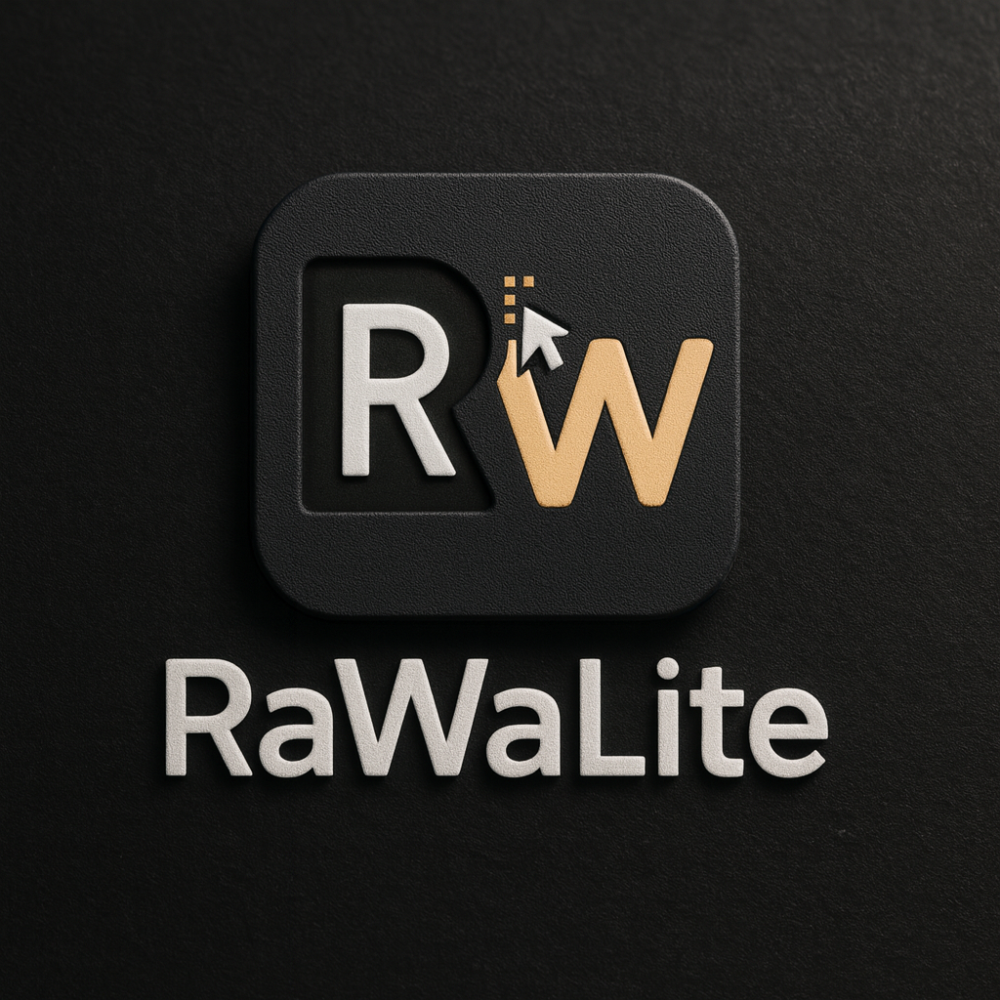

## 📄 Neue README.md (kopierfertig)

````markdown
# RawaLite – Professionelle Geschäftsverwaltung



> **Version** siehe [`src/lib/VersionService.ts`](src/lib/VersionService.ts)  
> Desktop-Anwendung für Geschäftsverwaltung mit **vollständig integriertem In-App Update-System**.

---

## 🏢 Proprietäre Software

**© 2025 MonaFP. Alle Rechte vorbehalten.**

---

## ⚡ Funktionen

- 👥 **Kundenverwaltung** – Auto-Nummerierung (K-001, K-002…)
- 📦 **Paketverwaltung** – Hierarchische Pakete (PAK-001…)
- 📋 **Angebote** – Workflow (AN-2025-0001…)
- 🧾 **Rechnungen** – Abrechnungssystem (RE-2025-0001…)
- ⏱️ **Leistungsnachweise** – Zeiterfassung (LN-2025-0001…)
- 🎨 **Pastell-Themes** – 5 vordefinierte, unveränderbare Farbpaletten
- 🔄 **Flexible Navigation** – Header/Sidebar mit Widgets
- 📄 **PDF-Export** – Theme-Integration, DIN 5008, 100 % offline
- 🔄 **Einheitliches Update-System** – In-App, ohne externe Links

---

## 🚀 Tech-Stack

- **Runtime:** Node.js 20.18.0  
- **Package Manager:** pnpm 10.15.1 (**PNPM-only**)  
- **Desktop:** Electron 31.7.7  
- **Frontend:** React 18.3.1 + TypeScript 5.9.2 (strict)  
- **Build:** Vite 5.4.20 + electron-builder 24.13.3  
- **DB:** SQLite (sql.js) primary, Dexie (IndexedDB) Dev-Fallback  
- **Update:** Custom In-App Updater (100 % in-app, `autoDownload: false`)  

---

## 📦 Installation

### Windows
1. Lade die aktuelle Setup-EXE aus dem GitHub Release (Asset `rawalite-Setup-X.Y.Z.exe`) herunter.  
2. Ausführen, Assistent folgen.  
3. Daten bleiben in `%APPDATA%/RawaLite/` persistent erhalten.  

### Updates
- Automatischer Check beim App-Start  
- Manuelle Prüfung im Header (Versionsnummer) oder über Einstellungen → Updates  
- Download/Install nur mit Bestätigung  
- Vor Installation wird automatisch ein Backup angelegt  

---

## 🛠️ Development (PNPM-only)

⚠️ Dieses Projekt ist **PNPM-ONLY**. Niemals npm oder yarn verwenden.

```bash
# Setup
pnpm install
pnpm dev                    # Vite + Electron

# Build
pnpm build                  # Production Build
pnpm dist                   # electron-builder (NO publish!)

# Tests & Guards
pnpm typecheck
pnpm lint
pnpm test                   # Unit Tests (Vitest)
pnpm e2e                    # Playwright (optional)

pnpm guard:external         # Keine externen Links
pnpm guard:pdf              # PDF-Assets offline
pnpm validate:ipc           # IPC Security Check
pnpm validate:versions      # Version-Sync
pnpm guard:release:assets   # Release Assets complete
````

---

## 🔄 CI/CD Workflows

### CI (`.github/workflows/ci.yml`)

* **verify-Job (Ubuntu):** Typecheck, Lint, Guards, Tests, optional E2E
* **build-Job (Windows):** Build + Dist, ohne `--publish`, mit

  * Cache-Cleanup (Setup <300 MB)
  * `latest.yml` mit `sha512`-Check
  * `builder-effective-config.yaml`-Check (`appId=com.rawalite.app`, `nsis.perMachine=false`)

### Release (`.github/workflows/release.yml`)

* **workflow_dispatch:**

  * Eingabe `patch`/`minor`/`major` → KI hebt Version automatisch in

    * `package.json`
    * `src/lib/VersionService.ts` (`BASE_VERSION`, `BUILD_DATE`)
  * Commit + Tag + Push
  * Build + Release
* **push tags vX.Y.Z:**

  * Build + Release-Upload über GitHub CLI (`gh release upload`)

---

## 📚 Dokumentation

> Alle Themen sind in `/docs/` als **Master-Dokumente** organisiert.
> Keine Redundanzen, jede Regel nur an einer Stelle.

### Hauptdokumente

* `00-index.md` – Übersicht & Code-Wahrheit
* `20-paths.md` – Pfad-Management
* `30-updates.md` – Update-System
* `40-pdf-workflow.md` – PDF-Workflow
* `50-persistence.md` – Persistenz
* `60-security-ipc.md` – Security & IPC
* `70-numbering.md` – Nummernkreise
* `80-ui-theme-navigation.md` – UI & Theme
* `90-deprecated-patterns.md` – Verbotene Muster
* `INSTRUCTIONS.md` – Safe Edition der Projektregeln
* `WORKFLOWS.md` – CI/CD Regeln

---

## 🐛 Debugging-Standards

Für **jedes Thema** (Unterordner in `/docs`) gilt:

* Eine Datei `lessons_learned.md` dokumentiert Debug-Versuche.
* Inhalt: **Was wurde versucht? Welches Ergebnis?**
* Das **Ergebnis muss aktiv beim Entwickler erfragt** werden, da Logs unvollständig sein können.
* Ziel: KI weiß, was schon probiert wurde → vermeidet doppelte Versuche.

---

## 🔒 Security & Compliance

* ✅ PNPM-only
* ✅ In-App Updates, keine externen Links
* ✅ PDF offline, alle Assets lokal & lizenzkonform
* ✅ IPC Security: `contextIsolation:true`, `sandbox:true`, typisierte Kanäle
* ✅ Release Pipeline: CI Guards, Cache-Checks, Upload nur via GitHub CLI

---

## 📋 Changelog

Siehe [docs/releases](docs/releases).

---

**© 2025 MonaFP. Alle Rechte vorbehalten.**

```

---
