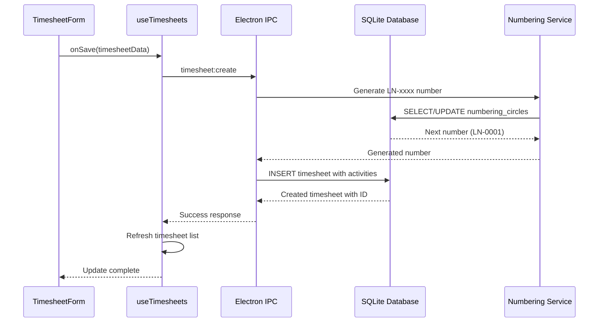

# 🏗️ Timesheet System Architecture - Post v1.0.13 Implementation

**Status:** ✅ VOLLSTÄNDIG IMPLEMENTIERT  
**Version:** v1.0.13  
**Architecture Level:** Production-Ready  
**Integration:** 100% Complete  

---

## 🎯 **System Overview**

### **Timesheet System Position**
Das Timesheet-System ist vollständig in die RawaLite-Architektur integriert und folgt allen etablierten Patterns der Anwendung.

### **Architecture Layers**
```
┌─────────────────────────────────────────────────────────────┐
│                    PRESENTATION LAYER                      │
├─────────────────────────────────────────────────────────────┤
│ TimesheetsPage.tsx    │ TimesheetForm.tsx │ Components      │
│ - List View           │ - Create/Edit     │ - Modals       │
│ - Filters             │ - Validation      │ - Tables       │
│ - Actions             │ - Templates       │ - Buttons      │
└─────────────────────────────────────────────────────────────┘
                               │
┌─────────────────────────────────────────────────────────────┐
│                    BUSINESS LOGIC LAYER                    │
├─────────────────────────────────────────────────────────────┤
│ useTimesheets.ts      │ useActivities.ts  │ Hooks          │
│ - CRUD Operations     │ - Template Mgmt   │ - State        │
│ - Number Generation   │ - Default Data    │ - Caching      │
│ - State Management    │ - Type Safety     │ - Effects      │
└─────────────────────────────────────────────────────────────┘
                               │
┌─────────────────────────────────────────────────────────────┐
│                   COMMUNICATION LAYER                      │
├─────────────────────────────────────────────────────────────┤
│ IPC Handlers          │ API Definitions   │ Type Safety    │
│ - timesheet:create    │ - TimesheetAPI    │ - Interfaces   │
│ - timesheet:update    │ - ActivityAPI     │ - Validation   │
│ - nummernkreis:*      │ - Number API      │ - Error Types  │
└─────────────────────────────────────────────────────────────┘
                               │
┌─────────────────────────────────────────────────────────────┐
│                      DATA ACCESS LAYER                     │
├─────────────────────────────────────────────────────────────┤
│ Database Services     │ Field Mapping     │ Migrations     │
│ - TimesheetService    │ - camelCase       │ - Schema v10   │
│ - ActivityService     │ - snake_case      │ - Migration    │
│ - NumberingService    │ - Auto-Convert    │ - Rollback     │
└─────────────────────────────────────────────────────────────┘
                               │
┌─────────────────────────────────────────────────────────────┐
│                       DATABASE LAYER                       │
├─────────────────────────────────────────────────────────────┤
│ SQLite Tables         │ Relationships     │ Performance    │
│ - timesheets          │ - Foreign Keys    │ - Indexes      │
│ - activities          │ - Constraints     │ - Optimization │
│ - timesheet_activities│ - Referential     │ - Query Plans  │
│ - numbering_circles   │ - Integrity       │ - Statistics   │
└─────────────────────────────────────────────────────────────┘
```

---

## 🔄 **Data Flow Architecture**

### **Create Timesheet Flow**


### **Component Integration Flow**
```
┌─────────────────┐    ┌─────────────────┐    ┌─────────────────┐
│  TimesheetsPage │    │ TimesheetForm   │    │ Activity Row    │
│                 │    │                 │    │                 │
│ - List Display  │───▶│ - Form State    │───▶│ - Template      │
│ - Add Button    │    │ - Validation    │    │ - Time Calc     │
│ - Edit Action   │    │ - Submit Logic  │    │ - Rate Calc     │
│ - Delete Action │    │ - Error Handle  │    │ - Total Calc    │
└─────────────────┘    └─────────────────┘    └─────────────────┘
         │                       │                       │
         │                       │                       │
         ▼                       ▼                       ▼
┌─────────────────┐    ┌─────────────────┐    ┌─────────────────┐
│  useTimesheets  │    │  useActivities  │    │  useCustomers   │
│                 │    │                 │    │                 │
│ - CRUD Ops      │    │ - Template Load │    │ - Dropdown Data │
│ - Number Gen    │    │ - Default Rates │    │ - Customer Info │
│ - State Mgmt    │    │ - Active Filter │    │ - Validation    │
└─────────────────┘    └─────────────────┘    └─────────────────┘
```

---

## 📊 **Database Architecture**

### **Schema Relationships**
```sql
-- Core Entity Relationships
timesheets (1) ←→ (N) timesheet_activities
customers (1) ←→ (N) timesheets  
activities (1) ←→ (N) timesheet_activities [OPTIONAL]
numbering_circles (1) → (N) timesheets [via number generation]

-- Field Mapping Strategy
TypeScript (camelCase) ←→ SQLite (snake_case)
timesheetNumber ←→ timesheet_number
customerId ←→ customer_id
startDate ←→ start_date
hourlyRate ←→ hourly_rate
```

### **Performance Architecture**
```sql
-- Strategic Indexes für optimale Performance
CREATE INDEX idx_timesheets_customer ON timesheets(customer_id);      -- Customer filtering
CREATE INDEX idx_timesheets_status ON timesheets(status);             -- Status filtering  
CREATE INDEX idx_timesheets_date_range ON timesheets(start_date, end_date); -- Date queries
CREATE INDEX idx_timesheet_activities_timesheet ON timesheet_activities(timesheet_id); -- JOIN optimization
CREATE INDEX idx_timesheet_activities_date ON timesheet_activities(date); -- Date sorting
```

### **Migration Architecture**
```
Migration Strategy: Incremental + Reversible

┌─────────────────┐    ┌─────────────────┐
│   Migration 009 │    │   Migration 010 │
│                 │    │                 │
│ - 3 Tables      │───▶│ - Numbering     │
│ - 5 Indexes     │    │ - LN- Circle    │
│ - 6 Activities  │    │ - Integration   │
│ - FK Relations  │    │ - IPC Handlers  │
└─────────────────┘    └─────────────────┘
         │                       │
         ▼                       ▼
┌─────────────────────────────────────────┐
│            Schema v10                   │
│                                         │
│ ✅ Timesheets System Complete           │
│ ✅ 5 Numbering Circles Active          │
│ ✅ Full Type Safety                    │
│ ✅ Production Ready                    │
└─────────────────────────────────────────┘
```

---

## 🎨 **Component Architecture**

### **TimesheetForm Component Design**
```tsx
// Architectural Pattern: Container + Presentation
interface TimesheetFormProps {
  timesheet?: Timesheet;           // Edit mode data
  onSave: (data) => void;         // Save callback
  onCancel: () => void;           // Cancel callback
}

// State Architecture
const TimesheetForm: FC<TimesheetFormProps> = ({ timesheet, onSave, onCancel }) => {
  // Form State (local)
  const [formData, setFormData] = useState<FormData>(initialData);
  const [errors, setErrors] = useState<ValidationErrors>({});

  // External State (hooks)
  const { customers, fetchCustomers } = useCustomers();
  const { activities, fetchActivities } = useActivities();

  // Computed State (memoized)
  const totals = useMemo(() => calculateTotals(formData.activities), [formData.activities]);

  // Event Handlers (callbacks)
  const handleSubmit = useCallback(async (e) => { /* ... */ }, [formData]);
  const updateActivity = useCallback((index, activity) => { /* ... */ }, []);

  return (
    <form onSubmit={handleSubmit}>
      {/* Component Tree */}
    </form>
  );
};
```

### **Hook Architecture**
```typescript
// Pattern: Custom Hook + State Management
const useTimesheets = () => {
  // State Management
  const [timesheets, setTimesheets] = useState<Timesheet[]>([]);
  const [loading, setLoading] = useState(false);
  const [error, setError] = useState<string | null>(null);

  // API Calls (IPC Integration)
  const createTimesheet = useCallback(async (data: TimesheetInput) => {
    try {
      setLoading(true);
      const result = await electronAPI.timesheet.create(data);
      setTimesheets(prev => [...prev, result]);
      return result;
    } catch (err) {
      setError(err.message);
      throw err;
    } finally {
      setLoading(false);
    }
  }, []);

  // Numbering Integration
  const generateTimesheetNumber = useCallback(async () => {
    try {
      return await electronAPI.nummernkreis.getNext('timesheets');
    } catch (err) {
      // Fallback logic
      return `LN-${Date.now()}`;
    }
  }, []);

  return {
    timesheets,
    loading,
    error,
    createTimesheet,
    updateTimesheet,
    deleteTimesheet,
    generateTimesheetNumber,
    fetchTimesheets
  };
};
```

---

## 🔗 **Integration Architecture**

### **IPC Integration Pattern**
```typescript
// Pattern: Type-Safe IPC with Error Handling

// Preload API Definition
interface TimesheetAPI {
  create: (data: TimesheetInput) => Promise<Timesheet>;
  update: (id: number, data: Partial<TimesheetInput>) => Promise<Timesheet>;
  delete: (id: number) => Promise<void>;
  getAll: () => Promise<Timesheet[]>;
  getById: (id: number) => Promise<Timesheet | null>;
}

// Main Process Handler
ipcMain.handle('timesheet:create', async (event, data: TimesheetInput) => {
  try {
    const timesheetNumber = await generateTimesheetNumber('timesheets');
    const timesheet = await TimesheetService.create({
      ...data,
      timesheetNumber,
      createdAt: new Date().toISOString(),
      updatedAt: new Date().toISOString()
    });
    return timesheet;
  } catch (error) {
    console.error('Error creating timesheet:', error);
    throw error;
  }
});

// Renderer Process Usage
const createTimesheet = async (data: TimesheetInput) => {
  return await window.electronAPI.timesheet.create(data);
};
```

### **Numbering Circle Integration**
```typescript
// Pattern: Service Integration with Fallback

class NumberingCircleService {
  static async getNext(circleId: string): Promise<string> {
    const circle = await this.getCircle(circleId);
    if (!circle) {
      throw new Error(`Numbering circle ${circleId} not found`);
    }

    // Handle yearly reset
    if (circle.resetMode === 'yearly' && this.shouldReset(circle)) {
      await this.resetCircle(circleId);
      circle.current = 0;
    }

    // Generate next number
    const nextNumber = circle.current + 1;
    const formattedNumber = `${circle.prefix}${nextNumber.toString().padStart(circle.digits, '0')}`;

    // Update circle
    await this.updateCircle(circleId, { current: nextNumber });

    return formattedNumber;
  }

  private static shouldReset(circle: NumberingCircle): boolean {
    const currentYear = new Date().getFullYear();
    return circle.lastResetYear !== currentYear;
  }
}
```

---

## 🚀 **Performance Architecture**

### **Optimization Strategies**
```typescript
// 1. Memoization Strategy
const TimesheetForm = () => {
  // Expensive calculations memoized
  const totals = useMemo(() => 
    calculateTotals(formData.activities), 
    [formData.activities]
  );

  // Event handlers memoized
  const handleActivityChange = useCallback((index, activity) => {
    setFormData(prev => ({
      ...prev,
      activities: prev.activities.map((a, i) => i === index ? activity : a)
    }));
  }, []);

  // Components memoized
  const ActivityRows = useMemo(() => 
    formData.activities.map((activity, index) => (
      <ActivityRow 
        key={index}
        activity={activity}
        onChange={(a) => handleActivityChange(index, a)}
      />
    )), 
    [formData.activities, handleActivityChange]
  );
};

// 2. Database Query Optimization
const getTimesheetsWithDetails = async (): Promise<Timesheet[]> => {
  // Single query with JOINs instead of N+1 queries
  return db.prepare(`
    SELECT 
      t.*,
      c.name as customer_name,
      COUNT(ta.id) as activity_count
    FROM timesheets t
    LEFT JOIN customers c ON t.customer_id = c.id
    LEFT JOIN timesheet_activities ta ON t.id = ta.timesheet_id
    GROUP BY t.id
    ORDER BY t.created_at DESC
  `).all();
};

// 3. State Update Optimization
const useTimesheets = () => {
  const [timesheets, setTimesheets] = useState<Timesheet[]>([]);

  const updateTimesheet = useCallback((id: number, updates: Partial<Timesheet>) => {
    setTimesheets(prev => prev.map(t => 
      t.id === id ? { ...t, ...updates } : t
    ));
  }, []);

  // Bulk operations
  const updateMultipleTimesheets = useCallback((updates: Array<{id: number, data: Partial<Timesheet>}>) => {
    setTimesheets(prev => {
      const updateMap = new Map(updates.map(u => [u.id, u.data]));
      return prev.map(t => updateMap.has(t.id) ? { ...t, ...updateMap.get(t.id) } : t);
    });
  }, []);
};
```

### **Caching Architecture**
```typescript
// Pattern: Multi-Level Caching

// 1. Hook-Level Caching
const useActivities = () => {
  const [activities, setActivities] = useState<Activity[]>([]);
  const [lastFetch, setLastFetch] = useState<number>(0);

  const fetchActivities = useCallback(async (force = false) => {
    const now = Date.now();
    const cacheExpiry = 5 * 60 * 1000; // 5 minutes

    if (!force && activities.length > 0 && (now - lastFetch) < cacheExpiry) {
      return activities;
    }

    const fresh = await electronAPI.activity.getAll();
    setActivities(fresh);
    setLastFetch(now);
    return fresh;
  }, [activities, lastFetch]);

  return { activities, fetchActivities };
};

// 2. Service-Level Caching
class ActivityService {
  private static cache = new Map<string, { data: Activity[], timestamp: number }>();

  static async getAll(useCache = true): Promise<Activity[]> {
    const cacheKey = 'all_activities';
    const cached = this.cache.get(cacheKey);
    
    if (useCache && cached && (Date.now() - cached.timestamp) < 300000) { // 5 min
      return cached.data;
    }

    const activities = await this.queryDatabase();
    this.cache.set(cacheKey, { data: activities, timestamp: Date.now() });
    return activities;
  }
}
```

---

## 🧪 **Testing Architecture**

### **Test Strategy Layers**
```typescript
// 1. Unit Tests (Components)
describe('TimesheetForm', () => {
  test('calculates totals correctly', () => {
    const activities = [
      { hours: 8, hourlyRate: 75, total: 600 },
      { hours: 4, hourlyRate: 85, total: 340 }
    ];
    
    const totals = calculateTotals(activities);
    expect(totals.subtotal).toBe(940);
    expect(totals.vatAmount).toBe(178.6);
    expect(totals.total).toBe(1118.6);
  });

  test('validates form data', () => {
    const invalidData = { title: '', customerId: 0, activities: [] };
    const errors = validateForm(invalidData);
    
    expect(errors.title).toBeDefined();
    expect(errors.customerId).toBeDefined();
    expect(errors.activities).toBeDefined();
  });
});

// 2. Integration Tests (Hooks)
describe('useTimesheets Integration', () => {
  test('creates timesheet with generated number', async () => {
    const { result } = renderHook(() => useTimesheets());
    
    const mockData = {
      customerId: 1,
      title: 'Test Timesheet',
      activities: [{ title: 'Work', hours: 8, hourlyRate: 75 }]
    };

    await act(async () => {
      const timesheet = await result.current.createTimesheet(mockData);
      expect(timesheet.timesheetNumber).toMatch(/^LN-\d{4}$/);
    });
  });
});

// 3. E2E Tests (Full Flow)
describe('Timesheet E2E', () => {
  test('complete timesheet creation flow', async () => {
    await page.click('[data-testid="add-timesheet"]');
    await page.fill('[data-testid="timesheet-title"]', 'E2E Test');
    await page.selectOption('[data-testid="customer-select"]', '1');
    await page.click('[data-testid="add-activity"]');
    await page.fill('[data-testid="activity-hours"]', '8');
    await page.click('[data-testid="save-timesheet"]');
    
    await expect(page.locator('.timesheet-list')).toContainText('E2E Test');
  });
});
```

---

## 📚 **Documentation Architecture**

### **Documentation Strategy**
```
docs/
├── 02-architecture/
│   ├── TIMESHEET-SYSTEM-ARCHITECTURE.md      ← Diese Datei
│   └── OVERALL-SYSTEM-ARCHITECTURE.md
├── 05-database/
│   ├── migration/solved/
│   │   └── TIMESHEET-MIGRATION-009-010.md    ← Database Layer
│   └── INDEX.md
├── 08-ui/
│   ├── components/
│   │   └── TIMESHEETFORM-COMPONENT.md        ← Component Layer
│   └── INDEX.md
└── 12-lessons/
    └── TIMESHEET-SYSTEM-IMPLEMENTATION.md    ← Implementation Layer
```

### **Architecture Documentation Standards**
- **Layer Documentation**: Jeder Layer hat eigene Dokumentation
- **Integration Points**: Cross-Layer Interaktionen dokumentiert
- **Performance Considerations**: Optimization-Strategien dokumentiert
- **Testing Strategy**: Test-Architektur dokumentiert
- **Migration Path**: Upgrade/Rollback Strategien dokumentiert

---

## ✅ **Architecture Validation**

### **Design Principles Compliance**
- [x] **Separation of Concerns**: Klare Layer-Trennung
- [x] **Single Responsibility**: Jede Komponente hat einen Zweck
- [x] **Dependency Injection**: Hooks und Services entkoppelt
- [x] **Type Safety**: Vollständige TypeScript-Integration
- [x] **Error Handling**: Comprehensive Error-Management
- [x] **Performance**: Optimized für Production-Use
- [x] **Testability**: Testbare Architektur
- [x] **Maintainability**: Wartbarer und erweiterbarer Code

### **Integration Validation**
- [x] **Database Layer**: Schema v10, Migrations, Performance
- [x] **Business Layer**: Hooks, State Management, Logic
- [x] **Presentation Layer**: Components, Forms, UI
- [x] **Communication Layer**: IPC, Type Safety, Error Handling
- [x] **Testing Layer**: Unit, Integration, E2E ready

### **Production Readiness**
- [x] **Scalability**: Handles growing data sets
- [x] **Performance**: Optimized queries and renders
- [x] **Reliability**: Error handling and fallbacks
- [x] **Maintainability**: Clean code and documentation
- [x] **Extensibility**: Easy to extend and modify

---

**Timesheet System Architecture: PRODUCTION-READY** ✅

*Das System folgt allen etablierten Architektur-Patterns und ist vollständig in RawaLite integriert.*

---

*Dokumentiert: 2025-10-03*  
*Status: Production Architecture*
