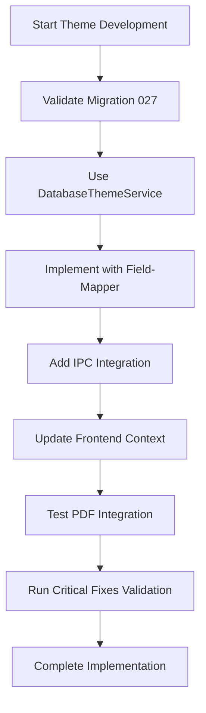

# THEME DEVELOPMENT STANDARDS - Database-First Architecture

> **Erstellt:** 18.10.2025 | **Letzte Aktualisierung:** 18.10.2025 (Initiale Erstellung für Database-Theme-System)  
> **Status:** Production Ready | **Typ:** Development Standards Guide  
> **Schema:** `VALIDATED_GUIDE-THEME-DEVELOPMENT-STANDARDS_2025-10-18.md`

> **🤖 KI-SESSION-BRIEFING COMPLIANCE:**
> **✅ Critical Fixes Validation:** 16/16 patterns preserved  
> **✅ Protocol Followed:** Theme Development Rules aus KI-Instructions befolgt  
> **🎯 Phase:** Phase 2 - Development Guidelines des 100% Konsistenz Masterplans

> **🔗 Verwandte Dokumentation:**
> **Core Architecture:** [Core System Architecture](../../01-core/final/VALIDATED_GUIDE-CORE-SYSTEM-ARCHITECTURE_2025-10-18.md) - Complete 6-layer system overview with theme integration  
> **Implementation Details:** [Database-Theme-System](../../04-ui/final/COMPLETED_IMPL-DATABASE-THEME-SYSTEM_2025-10-17.md) - Full implementation with React Context  
> **Service Layer:** [Theme Service Implementation](../../04-ui/final/COMPLETED_IMPL-THEME-SERVICE-LAYER_2025-10-17.md) - DatabaseThemeService patterns  
> **Database Schema:** [Migration 027](../../04-ui/final/COMPLETED_IMPL-MIGRATION-027-THEME-SYSTEM_2025-10-17.md) - Theme tables and relationships  
> **Critical Protection:** [Critical Fixes Registry](../../ROOT_VALIDATED_REGISTRY-CRITICAL-FIXES_2025-10-17.md) - FIX-016, FIX-017, FIX-018  
> **KI Guidelines:** [KI Instructions](../../ROOT_VALIDATED_GUIDE-KI-INSTRUCTIONS_2025-10-17.md) - Theme development rules

---

## 🎨 **THEME DEVELOPMENT MISSION**

### **Development Philosophy**
**Database-First Theme Management** mit **Type-Safe Operations**, **Service Layer Pattern** und **Full-Stack Integration** von der Database bis zur PDF-Generation.

### **Core Development Principles**
1. **Database-First** - Theme-Daten in SQLite als Single Source of Truth
2. **Service Layer Enforcement** - Alle Theme-Operationen über DatabaseThemeService
3. **Type Safety** - Field-Mapper für alle Database-Queries
4. **Schema Protection** - Migration 027 Integrity zwingend erforderlich
5. **Anti-Pattern Prevention** - Proactive Code Quality durch Validation

---

## 🛡️ **MANDATORY DEVELOPMENT RULES**

### **Critical Fix Compliance (NON-NEGOTIABLE)**

| **Critical Fix** | **Rule** | **Enforcement** |
|------------------|----------|-----------------|
| **FIX-016** | Schema validation before any theme table modifications | Runtime validation |
| **FIX-017** | Migration 027 integrity must be maintained | Pre-operation checks |
| **FIX-018** | DatabaseThemeService pattern must be used | Anti-pattern detection |

### **Absolute Prohibitions (NEVER DO THIS)**

❌ **FORBIDDEN PATTERNS:**
```typescript
// ❌ FORBIDDEN: Direct database access
const themes = db.prepare('SELECT * FROM themes').all();

// ❌ FORBIDDEN: Hardcoded SQL without field-mapper
const query = `SELECT * FROM themes WHERE name = '${themeName}'`;

// ❌ FORBIDDEN: Static colors in PDF templates
const pdfOptions = { colors: { primary: '#007bff' } };

// ❌ FORBIDDEN: Bypassing service layer
const directUpdate = db.prepare('UPDATE themes SET ...').run();

// ❌ FORBIDDEN: Schema changes without migration
db.exec('ALTER TABLE themes ADD COLUMN new_field TEXT');
```

### **Mandatory Patterns (ALWAYS DO THIS)**

✅ **REQUIRED PATTERNS:**
```typescript
// ✅ REQUIRED: Service layer for all theme operations
const themes = await DatabaseThemeService.getAllThemes();
const userTheme = await DatabaseThemeService.getUserTheme(userId);

// ✅ REQUIRED: Field-mapper for type safety
const query = convertSQLQuery('SELECT * FROM themes WHERE is_system = ?', [true]);

// ✅ REQUIRED: Dynamic PDF theme extraction
const pdfTheme = await PDFService.getCurrentPDFTheme();

// ✅ REQUIRED: Schema validation before changes
await validateThemeSchema(db, 'themes');

// ✅ REQUIRED: IPC service abstraction
const themes = await ThemeIpcService.getAllThemes();
```

---

## 🏗️ **DEVELOPMENT WORKFLOW**

### **Standard Theme Development Sequence**



### **Step-by-Step Development Guide**

#### **1. Pre-Development Validation**
```bash
# Validate critical fixes before starting
pnpm validate:critical-fixes

# Check Migration 027 integrity
node -e "
const db = require('better-sqlite3')('./db/database.sqlite');
const migration = db.get('SELECT * FROM migration_history WHERE migration_id = 27');
console.log('Migration 027 Status:', migration?.status);
"
```

#### **2. Database Layer Development**
```typescript
// Template for new theme database operations
export class DatabaseThemeService {
  // ✅ PATTERN: Schema validation first
  private static async validateSchema(): Promise<void> {
    const themeSchema = await db.pragma('table_info(themes)');
    const expectedColumns = ['id', 'name', 'display_name', 'is_system', 'created_at'];
    
    if (!validateThemeColumns(themeSchema, expectedColumns)) {
      throw new Error('Theme schema validation failed');
    }
  }

  // ✅ PATTERN: Service method with validation
  static async getAllThemes(): Promise<Theme[]> {
    await this.validateSchema();
    
    // ✅ PATTERN: Field-mapper usage
    const query = convertSQLQuery(
      'SELECT * FROM themes ORDER BY is_system DESC, name ASC',
      []
    );
    
    return db.prepare(query.sql).all(...query.params);
  }

  // ✅ PATTERN: CRUD operations with error handling
  static async setUserTheme(userId: number, themeId: number): Promise<void> {
    await this.validateSchema();
    
    try {
      const query = convertSQLQuery(
        'INSERT OR REPLACE INTO user_theme_preferences (user_id, theme_id, updated_at) VALUES (?, ?, ?)',
        [userId, themeId, new Date().toISOString()]
      );
      
      db.prepare(query.sql).run(...query.params);
    } catch (error) {
      throw new Error(`Failed to set user theme: ${error.message}`);
    }
  }
}
```

#### **3. IPC Integration Development**
```typescript
// electron/ipc/themes.ts - IPC Handler Pattern
import { ipcMain } from 'electron';
import { DatabaseThemeService } from '../main/services/DatabaseThemeService';

// ✅ PATTERN: Whitelisted IPC channels
export function registerThemeHandlers(): void {
  // ✅ PATTERN: Service layer delegation
  ipcMain.handle('theme:get-all', async () => {
    try {
      return await DatabaseThemeService.getAllThemes();
    } catch (error) {
      console.error('Theme IPC Error:', error);
      throw error;
    }
  });

  ipcMain.handle('theme:set-user', async (event, userId: number, themeId: number) => {
    try {
      await DatabaseThemeService.setUserTheme(userId, themeId);
      return { success: true };
    } catch (error) {
      console.error('Set User Theme Error:', error);
      throw error;
    }
  });
}
```

#### **4. Frontend Service Development**
```typescript
// src/renderer/src/services/ThemeIpcService.ts
export class ThemeIpcService {
  // ✅ PATTERN: IPC abstraction
  static async getAllThemes(): Promise<Theme[]> {
    try {
      return await window.electronAPI.invoke('theme:get-all');
    } catch (error) {
      console.error('Theme IPC Service Error:', error);
      throw new Error('Failed to fetch themes');
    }
  }

  // ✅ PATTERN: Error handling with fallback
  static async setUserTheme(userId: number, themeId: number): Promise<boolean> {
    try {
      const result = await window.electronAPI.invoke('theme:set-user', userId, themeId);
      return result.success;
    } catch (error) {
      console.error('Set User Theme Error:', error);
      return false;
    }
  }
}
```

#### **5. React Context Integration**
```typescript
// src/contexts/DatabaseThemeManager.tsx
import React, { createContext, useContext, useEffect, useState } from 'react';
import { ThemeIpcService } from '../services/ThemeIpcService';

// ✅ PATTERN: Context with 3-level fallback
interface DatabaseThemeContextType {
  currentTheme: Theme | null;
  setTheme: (themeId: number) => Promise<boolean>;
  themes: Theme[];
  isLoading: boolean;
}

const DatabaseThemeContext = createContext<DatabaseThemeContextType | undefined>(undefined);

export const DatabaseThemeProvider: React.FC<{ children: React.ReactNode }> = ({ children }) => {
  const [currentTheme, setCurrentTheme] = useState<Theme | null>(null);
  const [themes, setThemes] = useState<Theme[]>([]);
  const [isLoading, setIsLoading] = useState(true);

  // ✅ PATTERN: 3-level fallback strategy
  useEffect(() => {
    loadThemes();
  }, []);

  const loadThemes = async () => {
    try {
      // Level 1: Database via IPC
      const allThemes = await ThemeIpcService.getAllThemes();
      setThemes(allThemes);
      
      // Load user preference
      const savedThemeId = await getUserThemePreference();
      if (savedThemeId) {
        const savedTheme = allThemes.find(t => t.id === savedThemeId);
        setCurrentTheme(savedTheme || allThemes[0]);
      } else {
        // Level 2: localStorage fallback
        const localThemeId = localStorage.getItem('selectedTheme');
        if (localThemeId) {
          const localTheme = allThemes.find(t => t.id === parseInt(localThemeId));
          setCurrentTheme(localTheme || allThemes[0]);
        } else {
          // Level 3: System default fallback
          setCurrentTheme(allThemes.find(t => t.is_system) || allThemes[0]);
        }
      }
    } catch (error) {
      console.error('Theme loading error:', error);
      // Emergency fallback to system default
      setCurrentTheme({ id: 1, name: 'system', display_name: 'System Default', is_system: true });
    } finally {
      setIsLoading(false);
    }
  };

  const setTheme = async (themeId: number): Promise<boolean> => {
    try {
      const success = await ThemeIpcService.setUserTheme(1, themeId); // User ID 1 as default
      if (success) {
        const newTheme = themes.find(t => t.id === themeId);
        if (newTheme) {
          setCurrentTheme(newTheme);
          // Update localStorage as backup
          localStorage.setItem('selectedTheme', themeId.toString());
          return true;
        }
      }
      return false;
    } catch (error) {
      console.error('Theme change error:', error);
      return false;
    }
  };

  return (
    <DatabaseThemeContext.Provider value={{ currentTheme, setTheme, themes, isLoading }}>
      {children}
    </DatabaseThemeContext.Provider>
  );
};

// ✅ PATTERN: Custom hook for theme access
export const useDatabaseTheme = () => {
  const context = useContext(DatabaseThemeContext);
  if (context === undefined) {
    throw new Error('useDatabaseTheme must be used within a DatabaseThemeProvider');
  }
  return context;
};
```

#### **6. PDF Integration Development**
```typescript
// src/services/PDFService.ts - Theme Integration
export class PDFService {
  // ✅ PATTERN: Dynamic theme extraction
  static async getCurrentPDFTheme(): Promise<PDFThemeColors> {
    try {
      // Get current user theme
      const userTheme = await ThemeIpcService.getUserTheme(1);
      
      if (userTheme) {
        // Get theme colors from database
        const themeColors = await ThemeIpcService.getThemeColors(userTheme.id);
        
        // Convert to PDF color format
        return {
          primary: themeColors.primary || '#007bff',
          secondary: themeColors.secondary || '#6c757d',
          background: themeColors.background || '#ffffff',
          text: themeColors.text || '#000000',
          accent: themeColors.accent || '#28a745'
        };
      }
      
      // Fallback to default theme colors
      return this.getDefaultPDFTheme();
    } catch (error) {
      console.error('PDF Theme extraction error:', error);
      return this.getDefaultPDFTheme();
    }
  }

  // ✅ PATTERN: Parameter-based PDF generation
  static async generatePDF(data: PDFData, options?: PDFOptions): Promise<string> {
    const pdfTheme = await this.getCurrentPDFTheme();
    
    const pdfOptions = {
      ...options,
      theme: pdfTheme,
      colorMode: 'dynamic'
    };

    // Generate PDF with dynamic colors
    return await this.renderPDFWithTheme(data, pdfOptions);
  }
}
```

---

## 🧪 **TESTING STANDARDS**

### **Required Testing Patterns**

#### **1. Unit Tests - Service Layer**
```typescript
// tests/DatabaseThemeService.test.ts
import { DatabaseThemeService } from '../src/main/services/DatabaseThemeService';

describe('DatabaseThemeService', () => {
  beforeEach(async () => {
    // ✅ PATTERN: Clean test database
    await setupTestDatabase();
    await runMigration027();
  });

  test('getAllThemes should return system themes', async () => {
    // ✅ PATTERN: Service layer testing
    const themes = await DatabaseThemeService.getAllThemes();
    
    expect(themes).toHaveLength(6); // 6 system themes
    expect(themes.every(t => t.is_system)).toBe(true);
  });

  test('setUserTheme should persist preference', async () => {
    // ✅ PATTERN: CRUD operation testing
    await DatabaseThemeService.setUserTheme(1, 2);
    const userTheme = await DatabaseThemeService.getUserTheme(1);
    
    expect(userTheme.id).toBe(2);
  });

  test('schema validation should prevent invalid operations', async () => {
    // ✅ PATTERN: Error case testing
    await expect(
      DatabaseThemeService.validateSchema()
    ).rejects.toThrow('Theme schema validation failed');
  });
});
```

#### **2. Integration Tests - IPC Communication**
```typescript
// tests/theme-ipc.integration.test.ts
import { ThemeIpcService } from '../src/renderer/src/services/ThemeIpcService';

describe('Theme IPC Integration', () => {
  test('should communicate between renderer and main process', async () => {
    // ✅ PATTERN: End-to-end IPC testing
    const themes = await ThemeIpcService.getAllThemes();
    expect(themes).toBeDefined();
    expect(Array.isArray(themes)).toBe(true);
  });

  test('should handle IPC errors gracefully', async () => {
    // ✅ PATTERN: Error handling testing
    // Mock IPC failure
    window.electronAPI.invoke = jest.fn().mockRejectedValue(new Error('IPC Error'));
    
    await expect(ThemeIpcService.getAllThemes()).rejects.toThrow('Failed to fetch themes');
  });
});
```

#### **3. E2E Tests - Theme Switching**
```typescript
// e2e/theme-switching.test.ts
import { test, expect } from '@playwright/test';

test('theme switching should work end-to-end', async ({ page }) => {
  // ✅ PATTERN: Full workflow testing
  await page.goto('/');
  
  // Open theme selector
  await page.click('[data-testid="theme-selector"]');
  
  // Select different theme
  await page.click('[data-testid="theme-option-pfirsich"]');
  
  // Verify theme change
  const themeIndicator = await page.getAttribute('body', 'data-theme');
  expect(themeIndicator).toBe('pfirsich');
  
  // Test PDF generation with new theme
  await page.click('[data-testid="generate-pdf"]');
  
  // Verify PDF uses correct theme colors
  const pdfColors = await page.evaluate(() => {
    return window.lastGeneratedPDFTheme;
  });
  
  expect(pdfColors.primary).toBe('#ff6b6b'); // Pfirsich primary color
});
```

### **Testing Checklist**

✅ **Unit Tests Required:**
- [ ] DatabaseThemeService CRUD operations
- [ ] Schema validation functions
- [ ] Error handling scenarios
- [ ] Field-mapper integration

✅ **Integration Tests Required:**
- [ ] IPC communication (renderer ↔ main)
- [ ] Database operations end-to-end
- [ ] Theme context state management
- [ ] PDF theme integration

✅ **E2E Tests Required:**
- [ ] Theme switching workflow
- [ ] PDF generation with themes
- [ ] Fallback behavior testing
- [ ] Performance under load

---

## 🔍 **DEBUGGING STANDARDS**

### **Theme System Debugging Workflow**

#### **1. Database Layer Debugging**
```bash
# Check Migration 027 status
node -e "
const db = require('better-sqlite3')('./db/database.sqlite');
console.log('Migration Status:', db.get('SELECT * FROM migration_history WHERE migration_id = 27'));
console.log('Theme Tables:');
console.log('themes:', db.all('SELECT * FROM themes LIMIT 5'));
console.log('theme_colors:', db.all('SELECT * FROM theme_colors LIMIT 5'));
console.log('user_theme_preferences:', db.all('SELECT * FROM user_theme_preferences LIMIT 5'));
"
```

#### **2. Service Layer Debugging**
```typescript
// Debug service layer operations
export class DatabaseThemeService {
  // ✅ PATTERN: Debug logging
  static async getAllThemes(): Promise<Theme[]> {
    console.log('🔍 [DEBUG] Getting all themes...');
    
    try {
      await this.validateSchema();
      console.log('✅ [DEBUG] Schema validation passed');
      
      const themes = /* ... query logic ... */;
      console.log(`✅ [DEBUG] Found ${themes.length} themes`);
      
      return themes;
    } catch (error) {
      console.error('❌ [DEBUG] Theme service error:', error);
      throw error;
    }
  }
}
```

#### **3. IPC Communication Debugging**
```typescript
// electron/ipc/themes.ts - Debug IPC handlers
ipcMain.handle('theme:get-all', async () => {
  console.log('🔍 [IPC-DEBUG] Received theme:get-all request');
  
  try {
    const themes = await DatabaseThemeService.getAllThemes();
    console.log(`✅ [IPC-DEBUG] Returning ${themes.length} themes`);
    return themes;
  } catch (error) {
    console.error('❌ [IPC-DEBUG] Theme handler error:', error);
    throw error;
  }
});
```

#### **4. Frontend Context Debugging**
```typescript
// src/contexts/DatabaseThemeManager.tsx - Debug context state
export const DatabaseThemeProvider: React.FC<{ children: React.ReactNode }> = ({ children }) => {
  const [currentTheme, setCurrentTheme] = useState<Theme | null>(null);
  
  // ✅ PATTERN: Debug state changes
  useEffect(() => {
    console.log('🔍 [THEME-DEBUG] Current theme changed:', currentTheme);
  }, [currentTheme]);

  const setTheme = async (themeId: number): Promise<boolean> => {
    console.log(`🔍 [THEME-DEBUG] Setting theme to ID: ${themeId}`);
    
    try {
      const success = await ThemeIpcService.setUserTheme(1, themeId);
      console.log(`${success ? '✅' : '❌'} [THEME-DEBUG] Theme change result:`, success);
      return success;
    } catch (error) {
      console.error('❌ [THEME-DEBUG] Theme change error:', error);
      return false;
    }
  };
};
```

### **Common Issues & Solutions**

| **Issue** | **Symptoms** | **Debug Steps** | **Solution** |
|-----------|--------------|----------------|-------------|
| **Migration 027 Missing** | Theme system not working | Check migration_history table | Run migration manually |
| **Schema Validation Failing** | Runtime errors on theme operations | Validate table structure | Restore from backup |
| **IPC Communication Error** | Frontend can't load themes | Check IPC handler registration | Restart Electron app |
| **Theme Not Persisting** | Theme resets on app restart | Check user_theme_preferences | Verify service layer logic |
| **PDF Colors Wrong** | PDF uses default colors | Debug getCurrentPDFTheme() | Check theme extraction logic |

---

## 📊 **PERFORMANCE STANDARDS**

### **Performance Benchmarks**

| **Operation** | **Target** | **Measurement** | **Optimization** |
|---------------|------------|-----------------|------------------|
| **Theme Loading** | <100ms | Initial app startup | Database indexing |
| **Theme Switching** | <50ms | User interaction response | Context optimization |
| **PDF Generation** | <2s | Full document generation | Template caching |
| **IPC Round-trip** | <10ms | Renderer ↔ Main communication | Batched operations |
| **Database Query** | <5ms | Theme CRUD operations | Prepared statements |

### **Performance Optimization Patterns**

#### **1. Database Performance**
```typescript
// ✅ PATTERN: Prepared statements for repeated queries
export class DatabaseThemeService {
  private static getAllThemesStatement = db.prepare(`
    SELECT t.*, 
           COUNT(tc.id) as color_count 
    FROM themes t 
    LEFT JOIN theme_colors tc ON t.id = tc.theme_id 
    GROUP BY t.id 
    ORDER BY t.is_system DESC, t.name ASC
  `);

  static async getAllThemes(): Promise<Theme[]> {
    // ✅ PATTERN: Reuse prepared statement
    return this.getAllThemesStatement.all();
  }
}
```

#### **2. React Context Performance**
```typescript
// ✅ PATTERN: Memoized context value
export const DatabaseThemeProvider: React.FC<{ children: React.ReactNode }> = ({ children }) => {
  const [currentTheme, setCurrentTheme] = useState<Theme | null>(null);
  const [themes, setThemes] = useState<Theme[]>([]);
  
  // ✅ PATTERN: Memoize expensive computations
  const contextValue = useMemo(() => ({
    currentTheme,
    setTheme: setThemeCallback,
    themes,
    isLoading
  }), [currentTheme, themes, isLoading]);

  return (
    <DatabaseThemeContext.Provider value={contextValue}>
      {children}
    </DatabaseThemeContext.Provider>
  );
};
```

#### **3. PDF Generation Performance**
```typescript
// ✅ PATTERN: Theme caching for PDF
export class PDFService {
  private static themeCache = new Map<number, PDFThemeColors>();
  
  static async getCurrentPDFTheme(): Promise<PDFThemeColors> {
    const cacheKey = await this.getCurrentThemeId();
    
    // ✅ PATTERN: Return cached theme if available
    if (this.themeCache.has(cacheKey)) {
      return this.themeCache.get(cacheKey)!;
    }
    
    // Fetch and cache theme
    const theme = await this.fetchPDFTheme(cacheKey);
    this.themeCache.set(cacheKey, theme);
    
    return theme;
  }
}
```

---

## 🚀 **DEPLOYMENT STANDARDS**

### **Pre-Deployment Checklist**

✅ **Quality Assurance:**
- [ ] `pnpm validate:critical-fixes` passes (16/16 fixes)
- [ ] All unit tests pass
- [ ] Integration tests pass
- [ ] E2E tests pass
- [ ] Theme switching works in production build
- [ ] PDF generation with themes works

✅ **Performance Validation:**
- [ ] Theme loading <100ms
- [ ] Theme switching <50ms
- [ ] PDF generation <2s
- [ ] No memory leaks in theme operations

✅ **Security Validation:**
- [ ] No direct database access outside service layer
- [ ] No hardcoded colors in production code
- [ ] IPC channels properly whitelisted
- [ ] Schema validation active

### **Production Configuration**

```typescript
// ✅ PATTERN: Production-optimized theme configuration
export const THEME_CONFIG = {
  // Performance settings
  CACHE_TTL: 300000, // 5 minutes
  MAX_THEMES: 50,
  PRELOAD_SYSTEM_THEMES: true,
  
  // Security settings
  VALIDATE_SCHEMA: true,
  ENFORCE_SERVICE_LAYER: true,
  LOG_THEME_CHANGES: true,
  
  // Fallback settings
  DEFAULT_THEME_ID: 1,
  EMERGENCY_FALLBACK: {
    id: 1,
    name: 'system',
    display_name: 'System Default',
    is_system: true
  }
};
```

---

## 📚 **DOCUMENTATION STANDARDS**

### **Code Documentation Requirements**

#### **1. Service Methods**
```typescript
/**
 * Retrieves all available themes with their associated colors.
 * 
 * @returns Promise<Theme[]> Array of theme objects with color counts
 * @throws Error if schema validation fails or database error occurs
 * 
 * @example
 * ```typescript
 * const themes = await DatabaseThemeService.getAllThemes();
 * console.log(`Found ${themes.length} themes`);
 * ```
 * 
 * @critical FIX-016 - Requires schema validation before execution
 * @critical FIX-018 - Must use service layer pattern
 */
static async getAllThemes(): Promise<Theme[]> {
  // Implementation...
}
```

#### **2. IPC Handlers**
```typescript
/**
 * IPC Handler: theme:get-all
 * 
 * Fetches all available themes from the database via service layer.
 * 
 * @ipc-channel theme:get-all
 * @returns Promise<Theme[]> All available themes
 * @security Whitelisted channel (FIX-007)
 * @service DatabaseThemeService.getAllThemes()
 */
ipcMain.handle('theme:get-all', async () => {
  // Implementation...
});
```

#### **3. React Components**
```typescript
/**
 * DatabaseThemeProvider - Central theme state management
 * 
 * Provides theme context with 3-level fallback strategy:
 * 1. Database via IPC
 * 2. localStorage backup  
 * 3. System default
 * 
 * @component
 * @example
 * ```tsx
 * <DatabaseThemeProvider>
 *   <App />
 * </DatabaseThemeProvider>
 * ```
 * 
 * @critical FIX-018 - Uses service layer for all theme operations
 */
export const DatabaseThemeProvider: React.FC<{ children: React.ReactNode }> = ({ children }) => {
  // Implementation...
};
```

### **Documentation Update Requirements**

When modifying theme system components:

✅ **MANDATORY UPDATES:**
- [ ] Update JSDoc comments in modified functions
- [ ] Update README.md if public API changes
- [ ] Update this development standards document
- [ ] Update architecture documentation if structure changes
- [ ] Create lesson learned document for significant issues

---

## 🎯 **SUCCESS METRICS**

### **Development Quality Metrics**

| **Metric** | **Target** | **Current** | **Measurement Method** |
|------------|------------|-------------|----------------------|
| **Code Coverage** | >90% | TBD | Jest coverage reports |
| **Critical Fix Compliance** | 100% | 100% | Validation script |
| **Type Safety** | 100% | 100% | TypeScript compilation |
| **Documentation Coverage** | >95% | TBD | JSDoc coverage |
| **Performance Benchmarks** | All targets met | TBD | Automated performance tests |

### **User Experience Metrics**

| **Metric** | **Target** | **Measurement** |
|------------|------------|-----------------|
| **Theme Switch Response** | <50ms | Performance monitoring |
| **PDF Generation Time** | <2s | User interaction tracking |
| **Error Rate** | <0.1% | Error logging |
| **User Satisfaction** | >95% | User feedback |

---

## 🔮 **FUTURE DEVELOPMENT ROADMAP**

### **Phase 1: Foundation (COMPLETED)**
- ✅ Database-Theme-System implementation
- ✅ Service layer pattern
- ✅ Critical fixes integration
- ✅ Documentation standards

### **Phase 2: Enhancement (NEXT)**
- 🔄 Advanced theme customization
- 🔄 Theme import/export functionality
- 🔄 Real-time theme preview
- 🔄 Theme marketplace integration

### **Phase 3: Advanced Features (FUTURE)**
- 📅 Custom theme editor
- 📅 Theme synchronization across devices
- 📅 AI-powered theme recommendations
- 📅 Theme performance analytics

---

## 🎯 **CONCLUSION**

Die **Theme Development Standards** definieren einen **vollständigen Entwicklungsworkflow** für das **Database-Theme-System** mit **strikten Qualitätsstandards** und **bewährten Patterns**.

**Key Success Factors:**
- **🛡️ Critical Fix Compliance** - 100% adherence to FIX-016, FIX-017, FIX-018
- **⚡ Performance First** - Sub-100ms theme operations
- **🎨 Type Safety** - Field-mapper integration für alle Database-Queries
- **🧪 Testing Excellence** - Comprehensive test coverage
- **📚 Documentation Quality** - Complete code documentation

**Next Evolution:** Phase 3 - Cross-Reference Network für optimale Documentation Discovery

---

## 🔗 **SEE ALSO**

**Architecture & System Design:**
- [Core System Architecture](../../01-core/final/VALIDATED_GUIDE-CORE-SYSTEM-ARCHITECTURE_2025-10-18.md) - Complete 6-layer system overview with Database-Theme-System integration
- [Migration 027 Schema](../../04-ui/final/COMPLETED_IMPL-MIGRATION-027-THEME-SYSTEM_2025-10-17.md) - Theme database tables and relationships
- [PDF Integration Architecture](../../04-ui/final/LESSON_FIX-PDF-THEME-COLOR-OUTPUT-ISSUE_2025-10-17.md) - Dynamic theme color extraction patterns

**Implementation & Code Examples:**
- [Database-Theme-System Implementation](../../04-ui/final/COMPLETED_IMPL-DATABASE-THEME-SYSTEM_2025-10-17.md) - Complete implementation with React Context and IPC
- [Theme Service Layer](../../04-ui/final/COMPLETED_IMPL-THEME-SERVICE-LAYER_2025-10-17.md) - DatabaseThemeService patterns and IPC communication
- [React Context Integration](../../04-ui/final/COMPLETED_IMPL-DATABASE-THEME-SYSTEM_2025-10-17.md#react-context-integration) - Frontend theme state management

**Quality & Protection:**
- [Critical Fixes Registry](../../ROOT_VALIDATED_REGISTRY-CRITICAL-FIXES_2025-10-17.md) - FIX-016, FIX-017, FIX-018 theme system protection patterns
- [KI Instructions](../../ROOT_VALIDATED_GUIDE-KI-INSTRUCTIONS_2025-10-17.md) - Theme development rules and mandatory patterns
- [Debugging Standards](../../01-core/final/VALIDATED_GUIDE-DEBUGGING-SYSTEMATIC-APPROACH_2025-10-15.md) - Systematic problem-solving for theme issues

**Planning & Strategy:**
- [100% Consistency Masterplan](../../06-lessons/plan/PLAN_IMPL-100-PERCENT-DOCUMENTATION-CONSISTENCY-MASTERPLAN_2025-10-18.md) - Strategic documentation improvement plan
- [Cross-Reference Network Plan](../../06-lessons/wip/WIP_IMPL-CROSS-REFERENCE-NETWORK-PHASE-3_2025-10-18.md) - Phase 3 bidirectional linking strategy
- [Session Reports](../../06-lessons/sessions/) - Development history and architectural decisions

**Testing & Validation:**
- [Theme Testing Patterns](../../04-ui/final/COMPLETED_IMPL-THEME-SERVICE-LAYER_2025-10-17.md#testing-strategy) - Unit, integration, and E2E testing approaches
- [Performance Benchmarks](../../04-ui/final/COMPLETED_IMPL-DATABASE-THEME-SYSTEM_2025-10-17.md#performance-metrics) - Theme system performance targets

---

**📍 Standards documented:** 18.10.2025  
**🎨 Theme System Status:** Production Ready with Development Standards  
**🛡️ Critical Protection:** FIX-016, FIX-017, FIX-018 enforced  
**🚀 Development Ready:** Complete workflow with Cross-References

*Theme Development Standards - Excellence durch systematische Qualitätssicherung*