# 📊 RawaLite Database Architecture - Current State (Migration 029)

**Status**: ✅ Production Ready  
**Schema Version**: Migration 029 (Focus Mode System) - October 2025  
**Database Engine**: SQLite (better-sqlite3 12.4.1)  
**Journal Mode**: WAL (Write-Ahead Logging)  
**Location**: `%APPDATA%\Roaming\Electron\database\rawalite.db`

---

## 🎯 Architecture Overview

### **Core Design Principles**
- **Single-File Database**: SQLite for performance and reliability
- **Field-Mapping**: Central `convertSQLQuery()` for camelCase ↔ snake_case
- **Foreign Key Constraints**: Enforced relationships with CASCADE DELETE
- **Hierarchical Data**: Self-referencing FK for parent-child structures
- **Status Versioning**: Optimistic locking with version tracking
- **Migration System**: Idempotent, additive schema changes

### **Critical Patterns (NEVER VIOLATE)**
```typescript
// ✅ CORRECT: Use field-mapper for all DB access
const query = convertSQLQuery(`
  SELECT {id}, {companyName}, {createdAt} 
  FROM customers 
  WHERE {id} = ?
`);

// ❌ FORBIDDEN: Direct snake_case SQL
const query = `SELECT id, company_name, created_at FROM customers WHERE id = ?`;
```

---

## 🗄️ Database Schema (19 Business + 3 System Tables)

### **📊 Core Business Tables**

#### **1. customers** (1 record)
```sql
CREATE TABLE customers (
  id INTEGER PRIMARY KEY AUTOINCREMENT,
  number TEXT NOT NULL UNIQUE,
  company_name TEXT NOT NULL,
  contact_person TEXT,
  email TEXT, phone TEXT,
  address_street TEXT, address_zip TEXT, address_city TEXT,
  notes TEXT,
  created_at TEXT NOT NULL,
  updated_at TEXT NOT NULL
);
```
**Purpose**: Customer master data with auto-generated numbering  
**Relationships**: → offers, invoices, timesheets (CASCADE DELETE)

#### **2. packages** (1 record)
```sql
CREATE TABLE packages (
  id INTEGER PRIMARY KEY AUTOINCREMENT,
  internal_title TEXT NOT NULL,
  parent_package_id INTEGER REFERENCES packages(id) ON DELETE CASCADE,
  total REAL NOT NULL,
  add_vat INTEGER DEFAULT 0,
  created_at TEXT NOT NULL,
  updated_at TEXT NOT NULL
);
```
**Purpose**: Service package templates with hierarchical structure  
**Relationships**: → package_line_items (CASCADE DELETE)

#### **3. package_line_items** (3 records - Hierarchical Structure)
```sql
CREATE TABLE package_line_items (
  id INTEGER PRIMARY KEY AUTOINCREMENT,
  package_id INTEGER NOT NULL REFERENCES packages(id) ON DELETE CASCADE,
  title TEXT NOT NULL,
  description TEXT,
  quantity INTEGER NOT NULL DEFAULT 1,
  unit_price REAL NOT NULL DEFAULT 0,
  parent_item_id INTEGER REFERENCES package_line_items(id) ON DELETE CASCADE,
  hierarchy_level INTEGER NOT NULL DEFAULT 0,
  item_origin TEXT DEFAULT 'manual',
  sort_order INTEGER DEFAULT 0,
  client_temp_id TEXT,
  price_display_mode TEXT DEFAULT 'default'
);
```
**Purpose**: Package line items with self-referencing hierarchy  
**Current Data Structure**:
```
📦 ID 103: "nfgmn" (Parent) - €180,00
   ├─ ID 104: "bdyfb" (Sub-Item) - €90,00  
   └─ ID 105: "gfnvf" (Sub-Item) - €0,00
```

#### **4. offers** (4 records)
```sql
CREATE TABLE offers (
  id INTEGER PRIMARY KEY AUTOINCREMENT,
  offer_number TEXT NOT NULL UNIQUE,
  customer_id INTEGER NOT NULL REFERENCES customers(id) ON DELETE CASCADE,
  title TEXT NOT NULL,
  status TEXT NOT NULL DEFAULT 'draft',
  valid_until TEXT NOT NULL,
  subtotal REAL NOT NULL DEFAULT 0,
  vat_rate REAL NOT NULL DEFAULT 19,
  vat_amount REAL NOT NULL DEFAULT 0,
  total REAL NOT NULL DEFAULT 0,
  discount_type TEXT DEFAULT NULL,           -- Migration 013
  discount_value REAL DEFAULT NULL,
  discount_amount REAL DEFAULT NULL,
  subtotal_before_discount REAL DEFAULT NULL,
  notes TEXT,
  sent_at TEXT, accepted_at TEXT, rejected_at TEXT,
  version INTEGER DEFAULT 1,                -- Migration 015
  created_at TEXT NOT NULL,
  updated_at TEXT NOT NULL
);
```
**Purpose**: Customer quotations with status tracking and discounts  
**Relationships**: → offer_line_items, offer_status_history, offer_attachments

#### **5. offer_line_items** (6 records)
```sql
CREATE TABLE offer_line_items (
  id INTEGER PRIMARY KEY AUTOINCREMENT,
  offer_id INTEGER NOT NULL REFERENCES offers(id) ON DELETE CASCADE,
  title TEXT NOT NULL,
  description TEXT,
  quantity INTEGER NOT NULL DEFAULT 1,
  unit_price REAL NOT NULL DEFAULT 0,
  total REAL NOT NULL DEFAULT 0,
  parent_item_id INTEGER REFERENCES offer_line_items(id) ON DELETE CASCADE,
  item_type TEXT DEFAULT 'standalone',      -- Migration 011
  source_package_id INTEGER                -- Migration 011
);
```
**Purpose**: Offer line items with hierarchical structure and package import tracking

#### **6. invoices** (2 records)
```sql
CREATE TABLE invoices (
  id INTEGER PRIMARY KEY AUTOINCREMENT,
  invoice_number TEXT NOT NULL UNIQUE,
  customer_id INTEGER NOT NULL REFERENCES customers(id) ON DELETE CASCADE,
  title TEXT NOT NULL,
  status TEXT NOT NULL DEFAULT 'draft',
  due_date TEXT NOT NULL,
  subtotal REAL NOT NULL DEFAULT 0,
  vat_rate REAL NOT NULL DEFAULT 19,
  vat_amount REAL NOT NULL DEFAULT 0,
  total REAL NOT NULL DEFAULT 0,
  discount_type TEXT DEFAULT NULL,           -- Migration 013
  discount_value REAL DEFAULT NULL,
  discount_amount REAL DEFAULT NULL,
  subtotal_before_discount REAL DEFAULT NULL,
  version INTEGER DEFAULT 1,                -- Migration 015
  paid_at TEXT, overdue_at TEXT, cancelled_at TEXT,
  created_at TEXT NOT NULL,
  updated_at TEXT NOT NULL
);
```
**Purpose**: Customer invoices with payment tracking and discounts

#### **7. timesheets**
```sql
CREATE TABLE timesheets (
  id INTEGER PRIMARY KEY AUTOINCREMENT,
  timesheet_number TEXT NOT NULL UNIQUE,
  customer_id INTEGER NOT NULL REFERENCES customers(id) ON DELETE CASCADE,
  title TEXT NOT NULL,
  status TEXT NOT NULL DEFAULT 'draft',
  start_date TEXT NOT NULL,
  end_date TEXT NOT NULL,
  subtotal REAL NOT NULL DEFAULT 0,
  vat_rate REAL NOT NULL DEFAULT 19,
  vat_amount REAL NOT NULL DEFAULT 0,
  total REAL NOT NULL DEFAULT 0,
  version INTEGER DEFAULT 1,                -- Migration 015
  sent_at TEXT, accepted_at TEXT, rejected_at TEXT,
  created_at TEXT NOT NULL,
  updated_at TEXT NOT NULL
);
```
**Purpose**: Time tracking and billing for service hours

### **🔧 System Configuration Tables**

#### **8. settings** (1 record)
```sql
CREATE TABLE settings (
  id INTEGER PRIMARY KEY CHECK (id = 1),
  company_name TEXT, street TEXT, zip TEXT, city TEXT,
  phone TEXT, email TEXT, website TEXT,
  tax_id TEXT, vat_id TEXT,
  kleinunternehmer INTEGER DEFAULT 1,
  bank_name TEXT, bank_account TEXT, bank_bic TEXT,
  logo TEXT,                    -- Base64-encoded Logo
  tax_office TEXT,              -- Migration 012
  created_at TEXT, updated_at TEXT
);
```
**Purpose**: Company settings and configuration (singleton pattern)

#### **9. numbering_circles**
```sql
CREATE TABLE numbering_circles (
  id TEXT PRIMARY KEY,              -- 'customers', 'offers', etc.
  name TEXT NOT NULL,               -- 'Kunden', 'Angebote', etc.
  prefix TEXT NOT NULL,             -- 'K-', 'A-', etc.
  digits INTEGER NOT NULL DEFAULT 4,
  current INTEGER NOT NULL DEFAULT 0,
  reset_mode TEXT NOT NULL DEFAULT 'never',  -- 'never' | 'yearly'
  last_reset_year INTEGER,
  created_at TEXT NOT NULL,
  updated_at TEXT NOT NULL
);
```
**Purpose**: Auto-numbering system for all document types  
**Standard Configuration**:
```
- customers: K-YYYY-000N (yearly reset)
- offers: A-YYYY-000N (yearly reset)
- invoices: RE-YYYY-000N (yearly reset)
- packages: PKG-000N (no reset)
- timesheets: ST-YYYY-000N (yearly reset)
```

### **📜 Status History & Audit Tables**

#### **10-12. Status History Tables**
```sql
-- offer_status_history, invoice_status_history, timesheet_status_history
CREATE TABLE {entity}_status_history (
  id INTEGER PRIMARY KEY AUTOINCREMENT,
  {entity}_id INTEGER NOT NULL REFERENCES {entity}(id) ON DELETE CASCADE,
  old_status TEXT,
  new_status TEXT NOT NULL,
  changed_at TEXT NOT NULL,
  changed_by TEXT DEFAULT 'user',
  notes TEXT
);
```
**Purpose**: Complete audit trail for all status changes (Migration 015)

#### **13. update_history**
```sql
CREATE TABLE update_history (
  id INTEGER PRIMARY KEY AUTOINCREMENT,
  session_id TEXT NOT NULL,
  event_type TEXT NOT NULL,
  event_data TEXT,                  -- JSON
  notes TEXT,
  duration_ms INTEGER,
  platform TEXT DEFAULT 'win32',   -- Migration 017
  created_at TEXT NOT NULL
);
```
**Purpose**: System-level update and operation logging

### **📎 Attachment Tables**

#### **14-15. Attachment Tables**
```sql
-- offer_attachments, invoice_attachments  
CREATE TABLE {entity}_attachments (
  id INTEGER PRIMARY KEY AUTOINCREMENT,
  {entity}_id INTEGER NOT NULL REFERENCES {entity}(id) ON DELETE CASCADE,
  filename TEXT NOT NULL,
  original_name TEXT NOT NULL,
  file_size INTEGER NOT NULL,
  mime_type TEXT NOT NULL,
  created_at TEXT NOT NULL
);
```
**Purpose**: File attachments for offers and invoices

### **🎯 Activity & Template Tables**

#### **16. activities**
```sql
CREATE TABLE activities (
  id INTEGER PRIMARY KEY AUTOINCREMENT,
  title TEXT NOT NULL,
  description TEXT,
  default_duration INTEGER DEFAULT 60,     -- minutes
  default_rate REAL DEFAULT 0,
  active INTEGER DEFAULT 1,
  created_at TEXT NOT NULL,
  updated_at TEXT NOT NULL
);
```
**Purpose**: Reusable activity templates for timesheets

#### **17. timesheet_activities**
```sql
CREATE TABLE timesheet_activities (
  id INTEGER PRIMARY KEY AUTOINCREMENT,
  timesheet_id INTEGER NOT NULL REFERENCES timesheets(id) ON DELETE CASCADE,
  activity_id INTEGER REFERENCES activities(id),
  date TEXT NOT NULL,
  start_time TEXT NOT NULL,
  end_time TEXT NOT NULL,
  duration INTEGER NOT NULL,            -- minutes
  description TEXT,
  hourly_rate REAL NOT NULL,
  total REAL NOT NULL,
  created_at TEXT NOT NULL,
  updated_at TEXT NOT NULL
);
```
**Purpose**: Individual time entries within timesheets

### **🔄 System Tables**

#### **18. sqlite_sequence**
**Purpose**: SQLite auto-increment sequence tracking (system table)

---

## 🔗 Foreign Key Relationships

```mermaid
graph TB
    customers[👥 customers] --> offers[📋 offers]
    customers --> invoices[🧾 invoices] 
    customers --> timesheets[⏱️ timesheets]
    
    packages[📦 packages] --> package_line_items[📦 package_line_items]
    packages -.-> packages
    
    offers --> offer_line_items[📋 offer_line_items]
    offers --> offer_status_history[📜 offer_status_history]
    offers --> offer_attachments[📎 offer_attachments]
    
    invoices --> invoice_line_items[🧾 invoice_line_items]
    invoices --> invoice_status_history[📜 invoice_status_history]
    invoices --> invoice_attachments[📎 invoice_attachments]
    
    timesheets --> timesheet_activities[⏱️ timesheet_activities]
    timesheets --> timesheet_status_history[📜 timesheet_status_history]
    
    activities[🎯 activities] --> timesheet_activities
    
    package_line_items -.-> package_line_items
    offer_line_items -.-> offer_line_items
```



**Legend:**
- **Solid arrows**: Direct FK relationships with CASCADE DELETE
- **Dotted arrows**: Self-referencing FK for hierarchies

---

## 🌳 Hierarchical Data Patterns

### **Package Line Items Hierarchy**
```sql
-- Current data example:
📦 Package Line Items (3 records):
├─ ID 103: "nfgmn" (parent_item_id: NULL) - €180,00
   ├─ ID 104: "bdyfb" (parent_item_id: 103) - €90,00
   └─ ID 105: "gfnvf" (parent_item_id: 103) - €0,00

-- Query pattern for hierarchical display:
SELECT * FROM package_line_items 
WHERE package_id = ? 
ORDER BY 
  COALESCE(parent_item_id, id),  -- Group by parent
  parent_item_id NULLS FIRST,   -- Parents first
  sort_order                     -- Then sort order
```

### **Hierarchy Features**
- ✅ **Self-Referencing FK**: `parent_item_id → package_line_items(id)`
- ✅ **CASCADE DELETE**: Delete parent → all children deleted
- ✅ **Hierarchy Level**: Computed field for UI indentation
- ✅ **Sort Order**: Manual ordering within same level
- ✅ **Origin Tracking**: 'manual' vs 'imported' items

---

## 🔄 Migration System

### **Migration History (Schema v0 → v26)**
```
v0  → v1:  Initial schema creation
v1  → v2:  Customer schema fixes  
v2  → v3:  Settings restructure
v3  → v4:  Gap placeholder
v4  → v5:  Packages numbering
v5  → v6:  Fix missing circles
v6  → v7:  Packages invoice schema
v7  → v8:  Offers schema
v8  → v9:  Add timesheets
v9  → v10: Timesheets numbering
v10 → v11: Offer line items extension (FIX-005)
v11 → v12: Tax office field
v12 → v13: Discount system (FIX-006)
v13 → v14: Item origin system
v14 → v15: Status versioning (FIX-009)
v15 → v26: Additional migrations (details in migration files)
```

### **Migration Principles**
- **Idempotent**: Can be run multiple times safely
- **Additive**: Never removes existing data
- **Transactional**: All-or-nothing execution
- **Backup**: Auto-backup before each migration

---

## 🛡️ Critical Fixes Integration

### **Database-Related Critical Fixes**
- **FIX-005**: Offer Foreign Key Constraints (Migration 011)
- **FIX-006**: Discount System Schema (Migration 013)  
- **FIX-009**: Database Status Updates with Optimistic Locking (Migration 015)
- **FIX-012**: SQLite Parameter Binding (undefined → null conversion)

### **Field-Mapping Compliance**
```typescript
// All database access MUST use field-mapper
import { convertSQLQuery } from '../lib/field-mapper';

// ✅ CORRECT Pattern:
const customers = db.prepare(convertSQLQuery(`
  SELECT {id}, {companyName}, {contactPerson}, {createdAt}
  FROM customers 
  WHERE {companyName} LIKE ?
`)).all(`%${searchTerm}%`);

// ❌ FORBIDDEN Pattern:
const customers = db.prepare(`
  SELECT id, company_name, contact_person, created_at
  FROM customers 
  WHERE company_name LIKE ?
`).all(`%${searchTerm}%`);
```

---

## 📊 Performance Characteristics

### **Database Size & Performance**
- **Current Size**: ~50KB (small dataset)
- **Journal Mode**: WAL (Write-Ahead Logging)
- **PRAGMA Settings**:
  ```sql
  PRAGMA foreign_keys = ON;
  PRAGMA journal_mode = WAL;
  PRAGMA synchronous = NORMAL;
  PRAGMA cache_size = 10000;
  ```

### **Query Performance**
- **Indexed Fields**: All primary keys, foreign keys, unique constraints
- **Search Patterns**: LIKE queries on name/title fields
- **Hierarchical Queries**: Optimized with COALESCE sorting

---

## 🔍 Data Integrity

### **Current Data Health**
```
✅ Foreign Key Integrity: All constraints valid
✅ Hierarchy Consistency: No orphaned items  
✅ Numbering Sequences: All circles operational
✅ Status History: Complete audit trail
✅ Schema Version: Migration 029 (Focus Mode System)
✅ Theme System: Migration 027 applied (DatabaseThemeService)
✅ Navigation System: Migration 028 applied (DatabaseNavigationService)
✅ Focus Mode: Migration 029 applied (Enhanced UX modes)
```

### **System Tables (NEW - Migrations 027-029)**
```sql
-- Theme System (Migration 027)
CREATE TABLE themes (
  id INTEGER PRIMARY KEY AUTOINCREMENT,
  name TEXT NOT NULL UNIQUE,
  display_name TEXT NOT NULL,
  colors TEXT NOT NULL, -- JSON
  created_at TEXT NOT NULL,
  updated_at TEXT NOT NULL
);

-- Navigation State (Migration 028)  
CREATE TABLE navigation_state (
  id INTEGER PRIMARY KEY AUTOINCREMENT,
  user_id TEXT NOT NULL DEFAULT 'default',
  layout_mode TEXT NOT NULL DEFAULT 'header',
  sidebar_collapsed BOOLEAN DEFAULT FALSE,
  created_at TEXT NOT NULL,
  updated_at TEXT NOT NULL
);

-- Focus Mode Settings (Migration 029)
CREATE TABLE focus_mode (
  id INTEGER PRIMARY KEY AUTOINCREMENT,
  user_id TEXT NOT NULL DEFAULT 'default',
  enabled BOOLEAN DEFAULT FALSE,
  mode_type TEXT DEFAULT 'standard',
  created_at TEXT NOT NULL,
  updated_at TEXT NOT NULL
);
```

### **Validation Patterns**
```sql
-- Check for orphaned hierarchy items
SELECT COUNT(*) FROM package_line_items 
WHERE parent_item_id IS NOT NULL 
AND parent_item_id NOT IN (SELECT id FROM package_line_items);
-- Result: 0 (healthy)

-- Verify numbering circle integrity
SELECT id, current, last_reset_year FROM numbering_circles;
-- All circles have valid state
```

---

## 🚀 Future Considerations

### **Scalability Patterns**
- **Pagination**: Implement LIMIT/OFFSET for large datasets
- **Indexing**: Add indexes for frequently searched fields
- **Archiving**: Consider soft-delete patterns for historical data

### **Schema Evolution**
- **Version Tracking**: Continue incremental migrations
- **Backward Compatibility**: Maintain field-mapper patterns
- **Data Migration**: Plan for potential PostgreSQL migration

---

## 🔗 Related Documentation

- **[Field-Mapping System](./MAPPING_PROGRESS_REPORT.md)** - Complete field mapping implementation
- **[SQLite Adapter](./SQLITE-ADAPTER-COMPLETION.md)** - Adapter interface compliance
- **[Migration System](./final/SQLITE-DATABASE-SYSTEM.md)** - Detailed migration documentation
- **[Critical Fixes Registry](../00-meta/final/CRITICAL-FIXES-REGISTRY.md)** - Database-related fixes

---

**Last Updated**: October 15, 2025  
**Schema Version**: 26  
**Status**: ✅ Production Ready  
**Maintainer**: RawaLite Development Team
