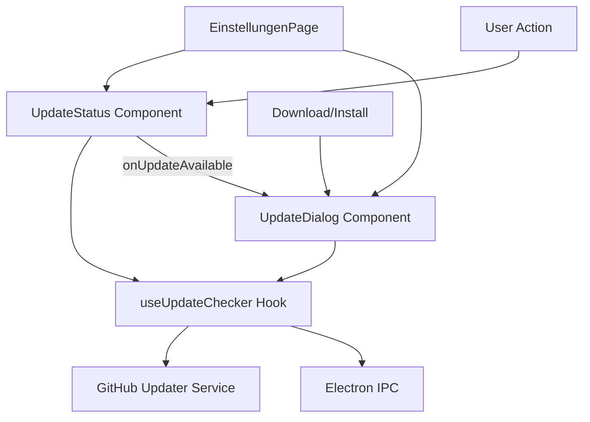

# ARCHITEKTUR: Update System - Component Separation & State Management
$12025-10-17**Version:** v1.0.42.2  
**Bereich:** Update System Architecture  
**Änderung:** Modal/Inline Component Separation

## Architektur-Übersicht

Das RawaLite Update System wurde von einer monolithischen Modal-Lösung zu einer hybriden Architektur mit separaten Verantwortlichkeiten umstrukturiert.

### System-Komponenten



## Component Architecture

### 1. UpdateStatus Component (Inline)

**Zweck:** Leichtgewichtige Status-Anzeige für Update-Checks

#### Verantwortlichkeiten
- ✅ Update-Check Trigger
- ✅ Inline Status-Display ("Checking", "Aktuell", "Fehler")
- ✅ User Feedback für einfache Operationen
- ✅ Bridge zu UpdateDialog bei verfügbaren Updates

#### Props Interface
```typescript
interface UpdateStatusProps {
  onUpdateAvailable?: () => void; // Callback für Modal-Trigger
}
```

#### State Management
```typescript
const {
  state,
  isChecking,
  hasUpdate,
  currentVersion,
  updateInfo,
  error,
  checkForUpdates,
  clearError
} = useUpdateChecker({
  autoCheckOnMount: false,
  onError: (err) => console.error('Update status error:', err)
});
```

#### Rendering Strategy
- **Conditional Inline Rendering** basierend auf Check-Status
- **Keine Overlays** - alles direkt im Updates-Tab
- **Persistent Status** - bleibt nach Check sichtbar

### 2. UpdateDialog Component (Modal)

**Zweck:** Komplexe Update-Workflows mit User-Interaktion

#### Verantwortlichkeiten
- ✅ Update Download mit Progress
- ✅ Installation Process
- ✅ User Consent Management
- ✅ Error Handling mit Retry
- ✅ Restart Coordination

#### Props Interface
```typescript
interface UpdateDialogProps {
  isOpen: boolean;
  onClose: () => void;
  autoCheckOnOpen?: boolean;
}
```

#### State Integration
- **Shared useUpdateChecker Hook** für konsistente Daten
- **Modal nur bei komplexen Operationen**
- **Auto-Close nach erfolgreichen einfachen Checks**

#### Exclusive UI Logic
```typescript
// Priority-based exclusive rendering
{(() => {
  if (error) return <ErrorComponent />;
  if (isChecking) return <CheckingComponent />;
  if (isDownloading) return <DownloadComponent />;
  if (hasUpdate) return <UpdateInfoComponent />;
  // Entfernt: "Version ist aktuell" - jetzt in UpdateStatus
  return <DefaultComponent />;
})()}
```

### 3. useUpdateChecker Hook (Shared State)

**Zweck:** Zentrales State Management für alle Update-Operationen

#### Hook Interface
```typescript
interface UseUpdateCheckerOptions {
  autoCheckOnMount?: boolean;
  onError?: (error: string) => void;
}

interface UseUpdateCheckerResult {
  state: UpdateState;
  isChecking: boolean;
  isDownloading: boolean;
  isInstalling: boolean;
  hasUpdate: boolean;
  currentVersion: string;
  latestVersion: string | null;
  updateInfo: UpdateInfo | null;
  downloadProgress: DownloadProgress | null;
  error: string | null;
  
  // Actions
  checkForUpdates: () => Promise<void>;
  startDownload: () => void;
  cancelDownload: () => void;
  installUpdate: () => void;
  restartApp: () => void;
  grantConsent: () => void;
  denyConsent: () => void;
  clearError: () => void;
}
```

#### State Machine
```typescript
type UpdatePhase = 
  | 'idle'
  | 'checking'
  | 'user-consent'
  | 'downloading'
  | 'download-completed'
  | 'installing'
  | 'restart-required'
  | 'completed'
  | 'error';
```

## Integration Pattern

### EinstellungenPage Integration

```typescript
export function EinstellungenPage() {
  const [updateDialogOpen, setUpdateDialogOpen] = useState(false);
  
  // Stable callback für UpdateDialog
  const handleCloseUpdateDialog = useCallback(() => 
    setUpdateDialogOpen(false), []);

  return (
    <div>
      {/* Inline Status im Updates-Tab */}
      {activeTab === 'updates' && (
        <UpdateStatus 
          onUpdateAvailable={() => setUpdateDialogOpen(true)}
        />
      )}
      
      {/* Modal nur bei komplexen Aktionen */}
      <UpdateDialog 
        isOpen={updateDialogOpen}
        onClose={handleCloseUpdateDialog}
        autoCheckOnOpen={false}
      />
    </div>
  );
}
```

## Communication Flow

### 1. Simple Update Check Flow
```
User clicks "Nach Updates suchen"
  ↓
UpdateStatus triggers checkForUpdates()
  ↓
useUpdateChecker performs GitHub API call
  ↓
Case A: No update → UpdateStatus shows "Version ist aktuell" inline
Case B: Update available → UpdateStatus calls onUpdateAvailable()
  ↓
onUpdateAvailable() opens UpdateDialog modal
  ↓
UpdateDialog handles download/install workflow
```

### 2. Auto-Check Flow (Future)
```
App startup
  ↓
UpdateStatus with autoCheck=true
  ↓
Silent check in background
  ↓
Only show modal if update available
```

## Design Decisions

### Warum Hybrid-Architektur?

#### 1. UX Verbesserung
- **Problem:** Modal-Overlay für einfache "Version aktuell" Meldung störend
- **Lösung:** Inline-Feedback für Status, Modal nur für Aktionen

#### 2. Code Maintainability  
- **Problem:** Ein Component für alle Update-Zustände wird komplex
- **Lösung:** Separation of Concerns mit klar definierten Rollen

#### 3. Performance
- **Problem:** Modal-Overhead für einfache Status-Checks
- **Lösung:** Lightweight inline rendering ohne DOM-Overlay

#### 4. Accessibility
- **Problem:** Modal-Focus-Management bei einfachen Meldungen
- **Lösung:** Inline Status bleibt im natürlichen Tab-Flow

### Alternative Ansätze (abgelehnt)

#### 1. ❌ Nur Modal-Lösung
```typescript
// Abgelehnt: Alles in UpdateDialog
<UpdateDialog isOpen={true} mode="status" />
```
**Nachteile:**
- Störende Overlays für einfache Meldungen
- Schlechte UX bei häufigen Checks
- Z-Index Konflikte

#### 2. ❌ Nur Inline-Lösung
```typescript
// Abgelehnt: Alles in UpdateStatus
<UpdateStatus showDownloadProgress={true} />
```
**Nachteile:**
- Komplexe Downloads brauchen fokussierte UI
- Keine klare User-Führung bei kritischen Operationen
- Layout-Probleme bei großen Progress-Displays

#### 3. ❌ Toast-Notifications
```typescript
// Abgelehnt: Toast für "Version aktuell"
showToast("Version ist aktuell");
```
**Nachteile:**
- Temporary Feedback - User kann Status nicht später einsehen
- Zusätzliche Toast-Library nötig
- Nicht persistent genug für Update-Status

## State Synchronization

### Shared Hook Pattern

Beide Components verwenden den gleichen `useUpdateChecker` Hook für konsistente Daten:

```typescript
// UpdateStatus Component
const updateStatusHook = useUpdateChecker({ autoCheckOnMount: false });

// UpdateDialog Component  
const updateDialogHook = useUpdateChecker({ autoCheckOnMount: false });

// Beide Hooks teilen sich den gleichen internen State
```

### State Persistence

```typescript
// Hook-interner State bleibt konsistent
const [internalState, setInternalState] = useState(initialState);

// Beide Components sehen die gleichen Updates
useEffect(() => {
  // State changes propagieren automatisch zu beiden Components
}, [internalState]);
```

## Error Handling Strategy

### UpdateStatus Error Handling
- **Inline Error Display** mit Retry-Button
- **Nicht-blockierende Errors** - User kann weiter arbeiten
- **Minimale Error-Info** für einfache Recovery

### UpdateDialog Error Handling
- **Modal Error Display** für kritische Fehler
- **Blockierende Errors** - User muss Fehler addressieren
- **Detaillierte Error-Info** für komplexe Recovery

### Error Kategorisierung
```typescript
interface ErrorClassification {
  type: 'network' | 'permission' | 'filesystem' | 'unknown';
  severity: 'info' | 'warning' | 'error' | 'critical';
  component: 'status' | 'dialog' | 'both';
  recovery: 'retry' | 'manual' | 'restart' | 'contact-support';
}
```

## Testing Strategy

### Component Testing
```typescript
// UpdateStatus Component Tests
describe('UpdateStatus', () => {
  test('shows inline status after check');
  test('calls onUpdateAvailable when update found');
  test('handles errors without modal');
  test('persists status after check completion');
});

// UpdateDialog Component Tests  
describe('UpdateDialog', () => {
  test('only opens for complex operations');
  test('handles download progress');
  test('manages installation workflow');
  test('coordinates restart process');
});
```

### Integration Testing
```typescript
// Combined Component Tests
describe('Update System Integration', () => {
  test('status component triggers dialog correctly');
  test('shared state remains consistent');
  test('error states handled appropriately in both components');
  test('user workflow from check to install');
});
```

## Future Enhancements

### 1. Background Auto-Checks
```typescript
// Geplant: Silent background checks
const useBackgroundUpdateChecker = () => {
  useEffect(() => {
    // Periodic silent checks
    const interval = setInterval(checkForUpdates, BACKGROUND_CHECK_INTERVAL);
    return () => clearInterval(interval);
  }, []);
};
```

### 2. Update Scheduling
```typescript
// Geplant: Scheduled updates
interface UpdateSchedule {
  type: 'immediate' | 'next-restart' | 'scheduled';
  scheduledTime?: Date;
  autoDownload?: boolean;
}
```

### 3. Update Notifications
```typescript
// Geplant: System notifications
const useUpdateNotifications = () => {
  const showNotification = (updateInfo: UpdateInfo) => {
    // Native OS notification
    new Notification('Update verfügbar', {
      body: `Version ${updateInfo.version} ist bereit`
    });
  };
};
```

## Performance Considerations

### Component Rendering
- **UpdateStatus**: Lightweight, minimal re-renders
- **UpdateDialog**: Heavy modal, render on demand only
- **Shared Hook**: Optimized with useCallback/useMemo

### Memory Usage
- **State Cleanup**: useEffect cleanup functions
- **Event Listener Management**: Proper addEventListener/removeEventListener
- **Reference Management**: WeakRef für optional cleanup

### Network Efficiency
- **Check Debouncing**: Prevent rapid successive checks
- **Cache Management**: ETags für conditional requests
- **Background Sync**: Service Worker für offline handling

---

**Fazit:** Die Hybrid-Architektur löst sowohl UX- als auch technische Probleme durch klare Trennung von einfachen Status-Updates und komplexen User-Workflows.