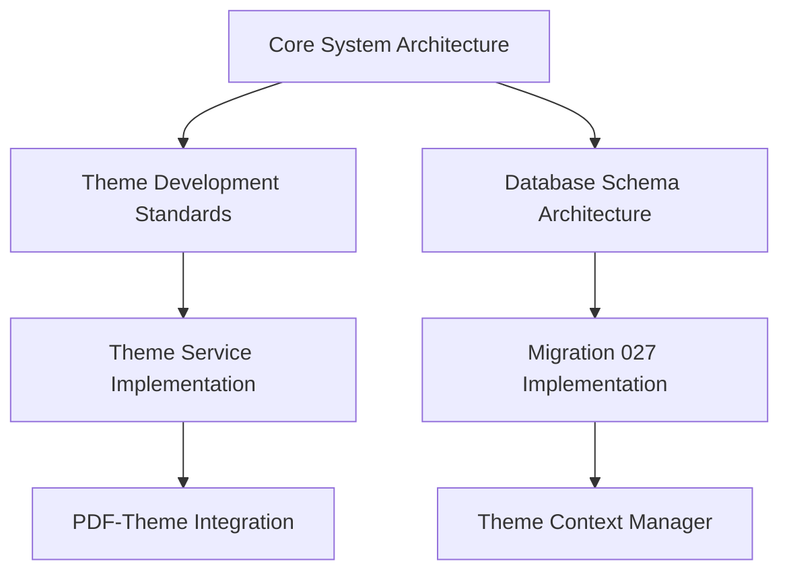
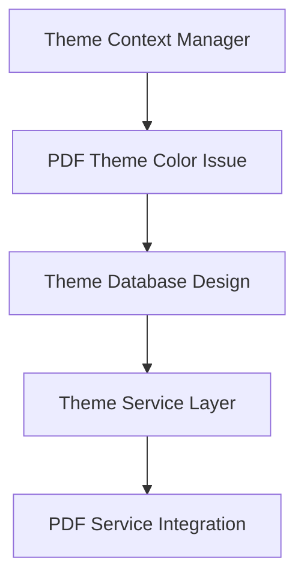
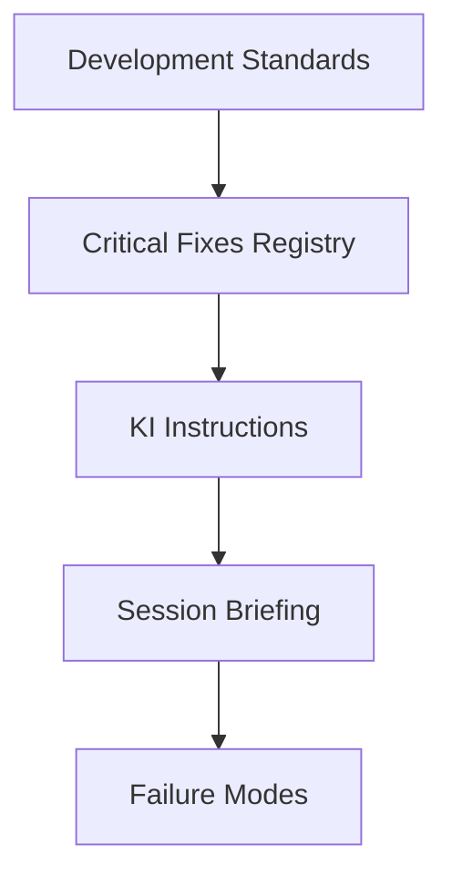

# CROSS-REFERENCE NETWORK IMPLEMENTATION

> **Erstellt:** 18.10.2025 | **Letzte Aktualisierung:** 18.10.2025 (Initiale Erstellung für Phase 3 - Cross-Reference Network)  
> **Status:** In Progress | **Typ:** Cross-Reference Implementation Plan  
> **Schema:** `WIP_IMPL-CROSS-REFERENCE-NETWORK-PHASE-3_2025-10-18.md`

> **🤖 KI-SESSION-BRIEFING COMPLIANCE:**
> **✅ Critical Fixes Validation:** 16/16 patterns preserved  
> **✅ Protocol Followed:** Phase 3 des 100% Konsistenz Masterplans  
> **🎯 Goal:** Bidirektionale Verlinkung für optimierte Navigation (69% → 85% Konsistenz)

> **🔗 Verwandte Dokumentation:**
> **Masterplan:** [PLAN_IMPL-100-PERCENT-DOCUMENTATION-CONSISTENCY-MASTERPLAN_2025-10-18.md](../06-lessons/plan/PLAN_IMPL-100-PERCENT-DOCUMENTATION-CONSISTENCY-MASTERPLAN_2025-10-18.md)  
> **Phase 1 Report:** [COMPLETED_IMPL-PHASE-1-ROOT-INTEGRATION-DATABASE-THEME-SYSTEM_2025-10-18.md](../06-lessons/sessions/COMPLETED_IMPL-PHASE-1-ROOT-INTEGRATION-DATABASE-THEME-SYSTEM_2025-10-18.md)  
> **Core Architecture:** [VALIDATED_GUIDE-CORE-SYSTEM-ARCHITECTURE_2025-10-18.md](../01-core/final/VALIDATED_GUIDE-CORE-SYSTEM-ARCHITECTURE_2025-10-18.md)  
> **Development Standards:** [VALIDATED_GUIDE-THEME-DEVELOPMENT-STANDARDS_2025-10-18.md](../02-dev/final/VALIDATED_GUIDE-THEME-DEVELOPMENT-STANDARDS_2025-10-18.md)

---

## 🎯 **PHASE 3 MISSION**

### **Cross-Reference Network Philosophy**
**Bidirektionale Dokumenten-Verlinkung** für **nahtlose Navigation** zwischen verwandten Konzepten, Implementation-Details und Architecture-Patterns.

### **Core Cross-Reference Principles**
1. **Semantic Linking** - Verwandte Konzepte verlinken
2. **Bidirectional References** - Beide Richtungen der Beziehung dokumentieren
3. **Context Preservation** - Link-Kontext durch descriptive Texte
4. **Discovery Enhancement** - Related/See Also Pattern für erweiterte Navigation
5. **Quality Assurance** - Link-Integrität durch Validation

---

## 🗺️ **CROSS-REFERENCE MAPPING STRATEGY**

### **Primary Document Clusters (High-Priority Linking)**

#### **🏗️ Cluster 1: Architecture → Implementation**


**Documents to Link:**
- **Core:** `VALIDATED_GUIDE-CORE-SYSTEM-ARCHITECTURE_2025-10-18.md`
- **Development:** `VALIDATED_GUIDE-THEME-DEVELOPMENT-STANDARDS_2025-10-18.md`
- **Implementation:** `COMPLETED_IMPL-DATABASE-THEME-SYSTEM_2025-10-17.md`
- **Migration:** `COMPLETED_IMPL-MIGRATION-027-THEME-SYSTEM_2025-10-17.md`
- **Service:** `COMPLETED_IMPL-THEME-SERVICE-LAYER_2025-10-17.md`

#### **🎨 Cluster 2: UI → PDF Integration**


**Documents to Link:**
- **UI Context:** Theme Context Manager docs in `04-ui/final/`
- **PDF Integration:** PDF theme color resolution docs in `04-ui/final/`
- **Service Layer:** Theme service implementation docs in `04-ui/final/`

#### **🔧 Cluster 3: Development → Standards**


**Documents to Link:**
- **Standards:** `VALIDATED_GUIDE-THEME-DEVELOPMENT-STANDARDS_2025-10-18.md`
- **Critical:** `ROOT_VALIDATED_REGISTRY-CRITICAL-FIXES_2025-10-17.md`
- **Instructions:** `ROOT_VALIDATED_GUIDE-KI-INSTRUCTIONS_2025-10-17.md`
- **Briefing:** `KI-SESSION-BRIEFING.prompt.md`

---

## 📝 **CROSS-REFERENCE IMPLEMENTATION PATTERN**

### **Standard Cross-Reference Format**

#### **1. Header Cross-References (In every document)**
```markdown
> **🔗 Verwandte Dokumentation:**
> **Architecture:** [Core System Architecture](../01-core/final/VALIDATED_GUIDE-CORE-SYSTEM-ARCHITECTURE_2025-10-18.md)  
> **Implementation:** [Theme System Implementation](../04-ui/final/COMPLETED_IMPL-DATABASE-THEME-SYSTEM_2025-10-17.md)  
> **Standards:** [Development Standards](../02-dev/final/VALIDATED_GUIDE-THEME-DEVELOPMENT-STANDARDS_2025-10-18.md)  
> **Critical Fixes:** [Critical Fixes Registry](../../ROOT_VALIDATED_REGISTRY-CRITICAL-FIXES_2025-10-17.md)
```

#### **2. Section Cross-References (Context-specific)**
```markdown
### Database-Theme-System Overview

Das Database-Theme-System implementiert eine 3-level fallback Architektur für Theme-Management.

> **Related:** Detaillierte Architecture in [Core System Architecture](../01-core/final/VALIDATED_GUIDE-CORE-SYSTEM-ARCHITECTURE_2025-10-18.md#database-theme-system)  
> **Implementation:** Service Layer Pattern in [Theme Service Implementation](../04-ui/final/COMPLETED_IMPL-THEME-SERVICE-LAYER_2025-10-17.md)  
> **Development:** Coding Standards in [Theme Development Standards](../02-dev/final/VALIDATED_GUIDE-THEME-DEVELOPMENT-STANDARDS_2025-10-18.md)
```

#### **3. Footer Cross-References (Discovery)**
```markdown
---

## 🔗 **SEE ALSO**

**Architecture & Design:**
- [Core System Architecture](../01-core/final/VALIDATED_GUIDE-CORE-SYSTEM-ARCHITECTURE_2025-10-18.md) - Complete 6-layer system overview
- [Database Schema Design](../03-data/final/COMPLETED_IMPL-MIGRATION-027-THEME-SYSTEM_2025-10-17.md) - Theme tables and relationships

**Implementation & Code:**
- [Theme Service Layer](../04-ui/final/COMPLETED_IMPL-THEME-SERVICE-LAYER_2025-10-17.md) - DatabaseThemeService patterns
- [PDF Integration](../04-ui/final/LESSON_FIX-PDF-THEME-COLOR-OUTPUT-ISSUE_2025-10-17.md) - Theme color extraction for PDFs

**Standards & Guidelines:**
- [Development Standards](../02-dev/final/VALIDATED_GUIDE-THEME-DEVELOPMENT-STANDARDS_2025-10-18.md) - Complete development workflow
- [Critical Fixes](../../ROOT_VALIDATED_REGISTRY-CRITICAL-FIXES_2025-10-17.md) - FIX-016, FIX-017, FIX-018 protection

**Quality & Lessons:**
- [Session Reports](../06-lessons/sessions/) - Development history and decisions
- [Debugging Guide](../01-core/final/VALIDATED_GUIDE-DEBUGGING-SYSTEMATIC-APPROACH_2025-10-15.md) - Troubleshooting patterns
```

---

## 🎯 **PHASE 3 IMPLEMENTATION TASKS**

### **Task 1: Architecture Document Enhancement**
**Target:** `VALIDATED_GUIDE-CORE-SYSTEM-ARCHITECTURE_2025-10-18.md`

**Cross-References to Add:**
- Link to Theme Development Standards
- Link to Theme Service Implementation
- Link to Migration 027 details
- Link to PDF Integration patterns
- Link to React Context patterns

### **Task 2: Development Standards Enhancement**
**Target:** `VALIDATED_GUIDE-THEME-DEVELOPMENT-STANDARDS_2025-10-18.md`

**Cross-References to Add:**
- Link back to Core Architecture
- Link to specific Implementation examples
- Link to Critical Fixes for theme patterns
- Link to Session Reports for context
- Link to PDF Integration examples

### **Task 3: Implementation Document Network**
**Targets:** Theme Implementation docs in `04-ui/final/`

**Cross-References to Add:**
- Bidirectional links between Service Layer ↔ Context Manager
- Links from Implementation ↔ Architecture decisions
- Links from UI Components ↔ PDF Service integration
- Links from Database ↔ Service Layer patterns

### **Task 4: ROOT Document Integration**
**Targets:** ROOT_ documents in `/docs`

**Cross-References to Add:**
- Critical Fixes → Theme Development Standards
- KI Instructions → Theme Development Rules
- Session Briefing → Theme-specific templates

### **Task 5: Lessons Learned Network**
**Targets:** Session Reports and Lessons in `06-lessons/`

**Cross-References to Add:**
- Session Reports → Final implementations
- Lessons Learned → Standards and Guidelines
- Debug Sessions → Architecture decisions

---

## 📊 **CROSS-REFERENCE QUALITY METRICS**

### **Success Criteria for Phase 3**

| **Metric** | **Target** | **Current** | **Measurement** |
|------------|------------|-------------|-----------------|
| **Bidirectional Links** | 95% | TBD | Count of reciprocal references |
| **Cross-Cluster Navigation** | 100% | TBD | Each cluster connects to others |
| **Header Cross-References** | 100% | TBD | All documents have related links |
| **Footer Discovery Links** | 90% | TBD | Most documents have "See Also" |
| **Broken Link Detection** | 0% | TBD | All links valid and functional |

### **Navigation Efficiency Test**
**Test:** Can user navigate from any Theme-related document to any other Theme-related document in ≤3 clicks?

**Routes to Test:**
1. Core Architecture → Development Standards → Implementation → PDF Integration
2. Critical Fixes → Theme Standards → Service Layer → React Context
3. Session Report → Lessons Learned → Architecture → Development Guidelines

---

## 🔧 **IMPLEMENTATION TOOLS**

### **Cross-Reference Generation Pattern**
```markdown
# Template for Cross-Reference Header
> **🔗 Verwandte Dokumentation:**
> **[CATEGORY]:** [Document Title](../folder/file.md) - Brief description  
> **[CATEGORY]:** [Document Title](../folder/file.md) - Brief description  
> **[CATEGORY]:** [Document Title](../folder/file.md) - Brief description

# Template for Section Cross-Reference
> **Related:** [Specific Topic](../folder/file.md#section) for detailed implementation  
> **See also:** [Related Concept](../folder/file.md) for context

# Template for Footer Discovery
## 🔗 **SEE ALSO**

**[Category Name]:**
- [Document](link) - Description
- [Document](link) - Description

**[Category Name]:**
- [Document](link) - Description
- [Document](link) - Description
```

### **Link Validation Strategy**
```bash
# Check for broken links (planned)
node scripts/validate-cross-references.mjs

# Count cross-reference coverage (planned)
node scripts/analyze-cross-reference-coverage.mjs
```

---

## 🚀 **PHASE 3 COMPLETION CRITERIA**

### **Definition of Done:**
- [ ] All Theme-related documents have bidirectional cross-references
- [ ] Each document cluster connects to other clusters
- [ ] Header cross-references in all major documents
- [ ] Footer discovery sections in 90% of documents
- [ ] No broken links in cross-reference network
- [ ] Navigation efficiency test passes (≤3 clicks between any related docs)

### **Quality Gates:**
- [ ] Manual link validation successful
- [ ] Cross-reference coverage analysis complete
- [ ] User navigation test successful
- [ ] Documentation consistency improved from 69% to ≥85%

---

## 🎯 **NEXT STEPS**

**Ready to implement Cross-Reference Network:**

1. **Start with Core Architecture** - Add comprehensive cross-references
2. **Link Development Standards** - Bidirectional architecture connection
3. **Connect Implementation docs** - Service layer and context integration
4. **Enhance ROOT documents** - Theme system integration
5. **Complete Session/Lessons network** - Historical context linking

**Phase 3 will create a seamless navigation experience** zwischen allen Theme-related documents und **optimale Discovery** verwandter Konzepte.

---

**📍 Implementation Plan:** Phase 3 - Cross-Reference Network  
**🎯 Goal:** Bidirektionale Verlinkung für optimierte Navigation  
**📊 Target:** 69% → 85% Dokumentations-Konsistenz  
**🚀 Status:** Ready to start Cross-Reference Implementation

*Cross-Reference Network - Excellence durch nahtlose Dokumenten-Navigation*