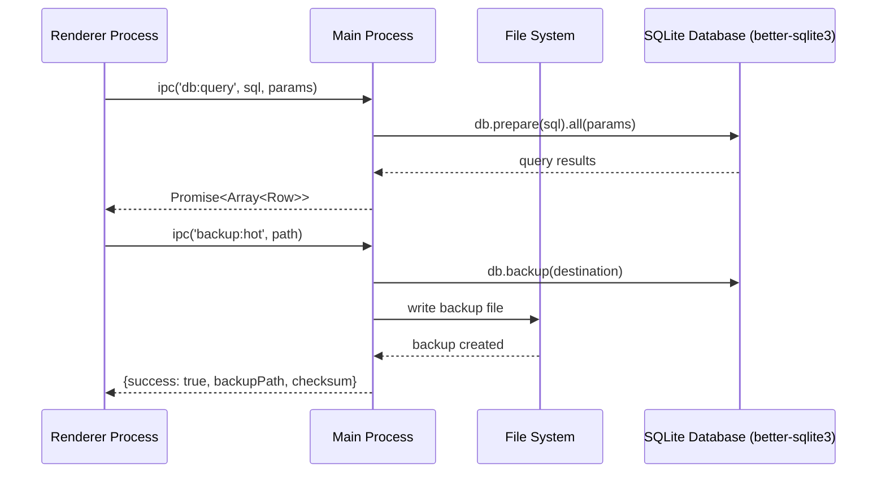
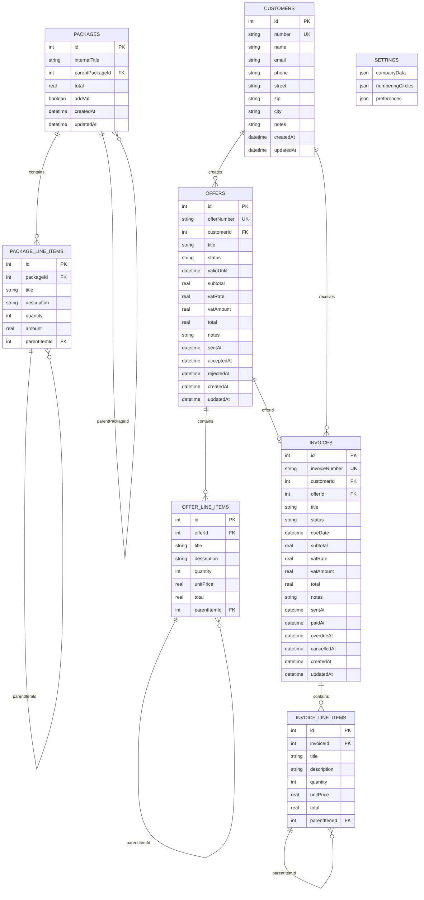

# 🏗️ Architektur - RawaLite

> **Technische Architektur & Des  │  ┌─────▼───────────────────────────┐   │
  │  │        Persistence Layer        │   │
  │  │  (SQLite + better-sqlite3)      │   │
  │  └─────────────────────────────────┘   │rinzipien** der RawaLite Desktop-Anwendung  
> **Letzte Aktualisierung:** 29. September 2025 | **Version:** 1.2.0

---

## 🎯 **Architektur-Übersicht**

RawaLite folgt einer **schichtbasierten Architektur** mit strikter Trennung von Verantwortlichkeiten und nutzt das Electron Framework für Desktop-Integration.

### **Electron Process Architecture**


### **Layer Architecture**
```
┌─────────────────────────────────────────┐
│             Electron Main Process        │
│         (Node.js + Native APIs)         │
└─────────────────────┬───────────────────┘
                      │ IPC Bridge (Secure)
┌─────────────────────▼───────────────────┐
│          Electron Renderer Process       │
│            (Chromium + React)           │
├─────────────────────────────────────────┤
│  ┌─────────────┐  ┌─────────────────┐   │
│  │   Pages     │  │   Components    │   │
│  │ (Routes)    │  │ (UI Elements)   │   │
│  └─────┬───────┘  └─────┬───────────┘   │
│        │                │               │
│  ┌─────▼───────┐  ┌─────▼───────────┐   │
│  │   Hooks     │  │   Services      │   │
│  │(Bus. Logic) │  │ (Export/PDF)    │   │
│  └─────┬───────┘  └─────┬───────────┘   │
│        │                │               │
│  ┌─────▼────────────────▼───────────┐   │
│  │         Contexts Layer          │   │
│  │ (State Management & Providers)   │   │
│  └─────┬───────────────────────────┘   │
│        │                               │
│  ┌─────▼───────────────────────────┐   │
│  │        Adapters Layer           │   │
│  │     (Database Abstraction)      │   │
│  └─────┬───────────────────────────┘   │
│        │                               │
│  ┌─────▼───────────────────────────┐   │
│  │        Persistence Layer        │   │
│  │    (SQLite + LocalStorage)      │   │
│  └─────────────────────────────────┘   │
└─────────────────────────────────────────┘
```

---

## 🗄️ **Database Schema Architecture**

### **Complete Business Entity Relationship Design**


### **Data Access Pattern**
```typescript
// Adapter Pattern für Database Abstraction
interface PersistenceAdapter {
  // Standardized CRUD Operations
  listCustomers(): Promise<Customer[]>;
  createCustomer(data: CreateCustomerData): Promise<Customer>;
  updateCustomer(id: number, patch: Partial<Customer>): Promise<Customer>;
  deleteCustomer(id: number): Promise<void>;
}

// Current Implementation: SQLite mit better-sqlite3
class SQLiteAdapter implements PersistenceAdapter {
  // Native SQLite operations mit prepared statements
  // IPC-only access für security
}

// Future: Cloud Sync Implementation  
class CloudSyncAdapter implements PersistenceAdapter {
  // Network-based operations mit offline fallback
}
```

---

## ⚡ **Security & Process Isolation**

### **Electron Security Model**
```typescript
// Secure Configuration
const secureDefaults = {
  webPreferences: {
    nodeIntegration: false,        // ❌ Node.js APIs im Renderer
    contextIsolation: true,        // ✅ Isolierte Contexts
    sandbox: true,                 // ✅ Sandboxed Renderer
    preload: preloadPath,          // ✅ Sicherer IPC-Bridge
    webSecurity: true             // ✅ Web Security aktiv
  }
};

// Controlled IPC API Surface
contextBridge.exposeInMainWorld('rawalite', {
  // Sichere Database APIs (better-sqlite3)
  db: {
    query: (sql: string, params?: any[]) => ipcRenderer.invoke('db:query', sql, params),
    exec: (sql: string, params?: any[]) => ipcRenderer.invoke('db:exec', sql, params),
    transaction: (queries: Array<{sql: string; params?: any[]}>) => 
      ipcRenderer.invoke('db:transaction', queries)
  },
  backup: {
    hot: (path?: string) => ipcRenderer.invoke('backup:hot', path),
    vacuumInto: (path: string) => ipcRenderer.invoke('backup:vacuumInto', path),
    integrityCheck: () => ipcRenderer.invoke('backup:integrityCheck'),
    restore: (path: string) => ipcRenderer.invoke('backup:restore', path)
  }
});
```

---

## 🏛️ **Frontend Architecture Patterns**

### **Complete React Component Hierarchie**
```
App.tsx                          # Root Layout Component
├── PersistenceProvider         # Database Context
├── SettingsProvider           # Settings Context  
├── LoadingProvider           # Loading State Context
├── NotificationProvider      # Toast Notifications
└── Router
    ├── Sidebar.tsx            # Navigation + Statistics
    ├── Header.tsx             # Page Header + Actions
    └── Pages/
        ├── DashboardPage.tsx   # Business Overview & KPIs
        ├── KundenPage.tsx     # Customer Management (CRUD)
        ├── AngebotePage.tsx   # Offers Management (CRUD)
        ├── AngebotDetailPage.tsx # Detailed Offer View
        ├── RechnungenPage.tsx # Invoices Management (CRUD)
        ├── PaketePage.tsx     # Package Templates (CRUD)
        ├── EinstellungenPage.tsx # Settings & Configuration
        ├── UpdatesPage.tsx    # Auto-Update Management
        └── NotFoundPage.tsx   # 404 Error Page
```

### **Business Logic Hooks Architecture**
```
src/hooks/
├── useCustomers.ts    # Customer CRUD + Validation
├── useOffers.ts       # Offers CRUD + Number Generation
├── useInvoices.ts     # Invoices CRUD + Status Workflow
├── usePackages.ts     # Package Templates CRUD
├── useSettings.ts     # Settings Management
└── useUnifiedSettings.ts # Unified Config Access
```

### **Reusable Form Components**
```
src/components/
├── CustomerForm.tsx   # Customer Create/Edit Form
├── OfferForm.tsx      # Offer Create/Edit Form (with Packages)
├── InvoiceForm.tsx    # Invoice Create/Edit Form (from Offers)
├── PackageForm.tsx    # Package Template Form
├── Table.tsx          # Generic Data Table Component
├── Header.tsx         # Page Header with Actions
└── Sidebar.tsx        # Navigation with Live Statistics
```

### **State Management Architecture**
```typescript
// Custom Hooks Pattern für Business Logic
export function useCustomers() {
  const { adapter } = usePersistence();
  const { getNextNumber } = useUnifiedSettings();
  
  // Local State
  const [customers, setCustomers] = useState<Customer[]>([]);
  const [loading, setLoading] = useState(true);
  const [error, setError] = useState<string | null>(null);
  
  // Business Logic Methods
  const createCustomer = async (data: CreateCustomerData) => {
    // 1. Validation
    // 2. Number Generation  
    // 3. Database Operation
    // 4. State Update
    // 5. Error Handling
  };
  
  return { customers, loading, error, createCustomer };
}
```

---

## 🔧 **Business Logic Architecture**

### **Complete Service Layer Design**
```typescript
// 🔢 Automatic Numbering Service
class NummernkreisService {
  // Handles automatic numbering for all business entities
  static async getNextNumber(circleId: string): Promise<string> {
    // 1. Load numbering configuration (yearly reset handling)
    // 2. Generate next sequential number with prefix
    // 3. Update counter in settings
    // 4. Return formatted number (e.g., "RE-2024-0001")
  }
}

// 📄 Export & PDF Generation Service  
class ExportService {
  // Multi-format export capabilities
  static exportCustomersToCSV(customers: Customer[]): void;
  static async exportOfferToPDF(offer: Offer, customer: Customer, settings: Settings, previewOnly?: boolean): Promise<void>;
  static async exportInvoiceToPDF(invoice: Invoice, customer: Customer, settings: Settings, previewOnly?: boolean): Promise<void>;
  
  // Features:
  // - CSV exports with proper encoding
  // - PDF generation with company branding
  // - Popup-free PDF preview with inline modal
  // - Proper VAT handling (Kleinunternehmer support)
  // - Hierarchical line items with sub-items
}

// 🖨️ Advanced PDF Service (Planned)
class PDFService {
  static async generatePDF(template: string, data: any, kleinunternehmer: boolean): Promise<Buffer>;
  // TODO: Implement when Electron PDF API available
}

// 🔐 Cryptography Service (Planned)
class CryptoService {
  static async generateKey(): Promise<CryptoKey>;
  static async encrypt(data: Uint8Array, key: CryptoKey): Promise<Uint8Array>;
  // TODO: Complete implementation for data encryption
}

// 📝 Logging Service
class LoggingService {
  static log(message: string): void;
  // TODO: File-based logging to %APPDATA%/logs with rotation
}
```

### **Error Handling Strategy**
```typescript
// Hierarchical Error Types
abstract class AppError extends Error {
  abstract readonly code: string;
  abstract readonly severity: 'low' | 'medium' | 'high' | 'critical';
}

class ValidationError extends AppError {
  readonly code = 'VALIDATION_ERROR';
  readonly severity = 'medium';
  
  constructor(message: string, public field?: string) {
    super(message);
  }
}

class DatabaseError extends AppError {
  readonly code = 'DATABASE_ERROR';  
  readonly severity = 'high';
  
  constructor(message: string, public cause?: Error) {
    super(message);
  }
}

// Centralized Error Handler
export function handleError(error: unknown): AppError {
  if (error instanceof AppError) return error;
  
  if (error instanceof Error) {
    return new DatabaseError(error.message, error);
  }
  
  return new DatabaseError('Unknown error occurred');
}
```

---

## 📊 **Business Features & Statistics Architecture**

### **Dashboard KPI Calculations**
```typescript
// Real-time Business Intelligence in DashboardPage
const dashboardStats = useMemo(() => {
  return {
    // Core Entity Counts
    totalCustomers: customers.length,
    totalOffers: offers.length,
    totalInvoices: invoices.length,
    totalPackages: packages.length,
    
    // Offer Pipeline Analytics
    pendingOffers: offers.filter(offer => offer.status === 'draft').length,
    sentOffers: offers.filter(offer => offer.status === 'sent').length,
    acceptedOffers: offers.filter(offer => offer.status === 'accepted').length,
    rejectedOffers: offers.filter(offer => offer.status === 'rejected').length,
    
    // Invoice Financial Analytics  
    paidInvoices: invoices.filter(inv => inv.status === 'paid').length,
    unpaidInvoices: invoices.filter(inv => ['draft', 'sent', 'overdue'].includes(inv.status)).length,
    overdueInvoices: invoices.filter(inv => inv.status === 'overdue').length,
    
    // Revenue Calculations
    totalOfferValue: offers.reduce((sum, offer) => sum + offer.total, 0),
    paidRevenue: invoices.filter(inv => inv.status === 'paid').reduce((sum, inv) => sum + inv.total, 0),
    unpaidRevenue: invoices.filter(inv => inv.status !== 'paid').reduce((sum, inv) => sum + inv.total, 0),
    
    // Conversion Metrics
    offerConversionRate: offers.length > 0 ? (acceptedOffers / offers.length) * 100 : 0,
    averageOfferValue: offers.length > 0 ? totalOfferValue / offers.length : 0
  };
}, [customers, offers, invoices, packages]);
```

### **Live Sidebar Statistics**
```typescript
// Real-time stats display in Sidebar component
const sidebarStats = {
  // Quick business health indicators
  pendingOffers: offers.filter(offer => offer.status === 'draft').length,
  acceptedOffers: offers.filter(offer => offer.status === 'accepted').length,
  paidInvoices: invoices.filter(invoice => invoice.status === 'paid').length,
  unpaidInvoices: invoices.filter(invoice => ['draft', 'sent', 'overdue'].includes(invoice.status)).length,
  totalOfferValue: offers.reduce((sum, offer) => sum + offer.total, 0),
  paidAmount: invoices.filter(inv => inv.status === 'paid').reduce((sum, inv) => sum + inv.total, 0)
};
```

### **Complete Database Performance Strategy**
```sql
-- Strategic Index Creation for All Entities
CREATE INDEX IF NOT EXISTS idx_customers_name ON customers(name);
CREATE INDEX IF NOT EXISTS idx_customers_email ON customers(email);

CREATE INDEX IF NOT EXISTS idx_offers_customer ON offers(customerId);  
CREATE INDEX IF NOT EXISTS idx_offers_status ON offers(status);
CREATE INDEX IF NOT EXISTS idx_offers_number ON offers(offerNumber);
CREATE INDEX IF NOT EXISTS idx_offers_valid ON offers(validUntil);

CREATE INDEX IF NOT EXISTS idx_invoices_customer ON invoices(customerId);
CREATE INDEX IF NOT EXISTS idx_invoices_status ON invoices(status);
CREATE INDEX IF NOT EXISTS idx_invoices_number ON invoices(invoiceNumber);
CREATE INDEX IF NOT EXISTS idx_invoices_due ON invoices(dueDate);
CREATE INDEX IF NOT EXISTS idx_invoices_offer ON invoices(offerId);

CREATE INDEX IF NOT EXISTS idx_packages_title ON packages(internalTitle);
CREATE INDEX IF NOT EXISTS idx_line_items_offer ON offer_line_items(offerId);
CREATE INDEX IF NOT EXISTS idx_line_items_invoice ON invoice_line_items(invoiceId);
CREATE INDEX IF NOT EXISTS idx_line_items_package ON package_line_items(packageId);

-- Optimized Business Intelligence Queries
SELECT 
  c.id, c.number, c.name, c.email,
  COUNT(DISTINCT o.id) as offerCount,
  COUNT(DISTINCT i.id) as invoiceCount,
  COALESCE(SUM(CASE WHEN i.status = 'paid' THEN i.total END), 0) as paidRevenue,
  COALESCE(SUM(CASE WHEN i.status != 'paid' THEN i.total END), 0) as unpaidRevenue,
  COALESCE(SUM(o.total), 0) as totalOfferValue
FROM customers c
LEFT JOIN offers o ON c.id = o.customerId
LEFT JOIN invoices i ON c.id = i.customerId
WHERE c.name LIKE ? OR c.email LIKE ?
GROUP BY c.id, c.number, c.name, c.email
ORDER BY paidRevenue DESC
LIMIT 50;
```

---

## 🧪 **Testing Architecture Strategy**

### **Testing Pyramid Implementation**
```
                    /\
                   /  \
                  /E2E \      ← Playwright
                 /Tests\      (Complete Workflows)
                /_____\
               /       \
              /Integration\    ← React Testing Library
             /__Tests___\     (Components + Hooks)
            /             \
           /     Unit      \   ← Vitest  
          /____Tests____\_\   (Pure Functions)
```

### **Test Strategy Per Layer**
```typescript
// Unit Tests - Pure Business Logic
describe('NummernkreisService', () => {
  test('generates sequential customer numbers', () => {
    const service = new NummernkreisService(mockConfig);
    expect(service.getNextNumber('customers')).toBe('K-0001');
    expect(service.getNextNumber('customers')).toBe('K-0002');
  });
});

// Integration Tests - Hook + Adapter Integration
describe('useCustomers Hook', () => {
  test('creates customer through full stack', async () => {
    const { result } = renderHook(() => useCustomers(), {
      wrapper: PersistenceProvider
    });
    
    await act(async () => {
      await result.current.createCustomer({ name: 'Test User' });
    });
    
    expect(result.current.customers).toHaveLength(1);
  });
});

// E2E Tests - Complete User Workflows
test('Customer Management Workflow', async ({ page }) => {
  await page.goto('/kunden');
  await page.click('[data-testid="add-customer"]');
  await page.fill('[data-testid="name-input"]', 'John Doe');
  await page.click('[data-testid="save-button"]');
  
  await expect(page.locator('.customer-list')).toContainText('John Doe');
});
```

---

## 🔄 **Build & Deployment Architecture**

### **Multi-Stage Build Pipeline**
```bash
# Development (pnpm dev)
┌─────────────────────────────────────────┐
│ Vite Dev Server (Hot Module Reload)    │
│ ├── TypeScript Watch Mode              │
│ ├── ESLint Real-time Linting           │
│ └── React DevTools Integration          │
└─────────────────────────────────────────┘
┌─────────────────────────────────────────┐
│ Electron Main Process                   │
│ ├── File System Access                 │
│ ├── Native API Integration              │
│ └── IPC Bridge Management               │
└─────────────────────────────────────────┘

# Production Build (pnpm build)
┌─────────────────────────────────────────┐
│ Frontend Build                          │
│ ├── TypeScript Compilation             │
│ ├── Vite Production Build               │
│ ├── Asset Optimization                  │
│ └── Tree Shaking & Minification         │
└─────────────────────────────────────────┘
┌─────────────────────────────────────────┐
│ Electron Build                          │
│ ├── Main Process Compilation            │
│ ├── Preload Script Build                │
│ └── Native Dependencies Bundling        │
└─────────────────────────────────────────┘

# Distribution (pnpm dist)  
┌─────────────────────────────────────────┐
│ Electron Builder                        │
│ ├── Platform-specific Packaging         │
│ ├── Code Signing (optional)             │
│ ├── Installer Generation (NSIS)         │
│ └── Update Manifest Creation             │
└─────────────────────────────────────────┘
```

### **Environment-specific Configuration**
```typescript
// Environment Detection & Configuration
const isDev = !app.isPackaged;
const isTest = process.env.NODE_ENV === 'test';

// Development Configuration
if (isDev) {
  app.commandLine.appendSwitch('enable-logging');
  win.webContents.openDevTools({ mode: 'detach' });
  win.loadURL('http://localhost:5173');
}

// Production Configuration
if (!isDev) {
  // Security hardening
  app.commandLine.appendSwitch('disable-web-security', 'false');
  win.loadFile(path.join(rootPath, 'index.html'));
  
  // Error reporting setup
  process.on('uncaughtException', handleProductionError);
}

// Test Configuration
if (isTest) {
  // Test-specific database  
  // Mocked external services
  // Faster startup configuration
}
```

---

## 📈 **Monitoring & Observability**

### **Application Health Monitoring**
```typescript
interface HealthMetrics {
  system: {
    memoryUsage: number;
    cpuUsage: number;
    diskSpace: number;
    startupTime: number;
  };
  
  database: {
    connectionStatus: 'connected' | 'error';
    size: number;
    queryPerformance: Record<string, number>;
    lastBackup: string;
  };
  
  application: {
    activeUsers: number;
    errorRate: number;
    responseTime: number;
    featureUsage: Record<string, number>;
  };
}

class HealthMonitor {
  static async getHealthSnapshot(): Promise<HealthMetrics> {
    return {
      system: await this.getSystemMetrics(),
      database: await this.getDatabaseMetrics(),
      application: await this.getApplicationMetrics()
    };
  }
  
  static startPeriodicHealthCheck() {
    setInterval(async () => {
      const health = await this.getHealthSnapshot();
      if (health.system.memoryUsage > MEMORY_THRESHOLD) {
        console.warn('High memory usage detected:', health.system.memoryUsage);
      }
    }, 30000); // Every 30 seconds
  }
}
```

---

## 🎯 **Architectural Principles**

### **Design Principles**
- **🎯 Single Responsibility:** Jede Klasse/Modul hat genau eine Aufgabe
- **🔗 Dependency Inversion:** Abhängigkeiten zeigen zu Abstraktionen
- **🔒 Encapsulation:** Interne Details sind vor Clients versteckt
- **📐 Composition over Inheritance:** Flexibilität durch Zusammensetzung
- **⚡ Performance by Design:** Performance-Überlegungen von Anfang an

### **Quality Attributes**
- **🛡️ Security:** Principle of Least Privilege, Input Validation
- **📈 Scalability:** Lazy Loading, Virtualization, Efficient Queries
- **🔧 Maintainability:** Clean Code, Documentation, Testing
- **⚡ Performance:** Memoization, Indexing, Bundle Optimization
- **🧪 Testability:** Dependency Injection, Pure Functions

### **Constraints & Trade-offs**
- **Desktop-First:** Optimiert für Electron, nicht für Web
- **SQLite Limitations:** Keine Concurrent Writers, File-based
- **Bundle Size vs Features:** Balance zwischen Funktionalität und Performance
- **Security vs Convenience:** Sichere Defaults, benutzerfreundliche APIs

---

*Letzte Aktualisierung: 29. September 2025 | Nächste Review: Dezember 2025*