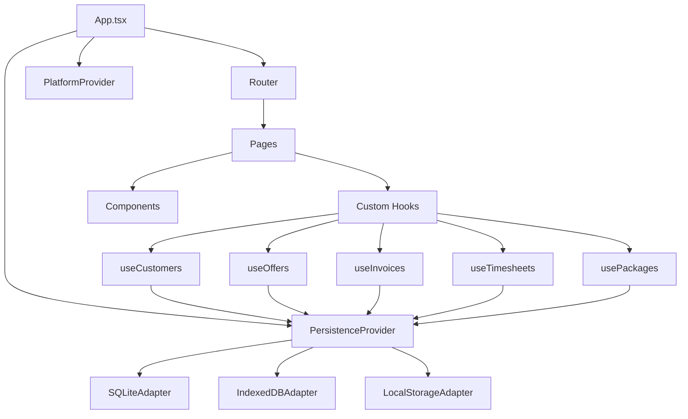
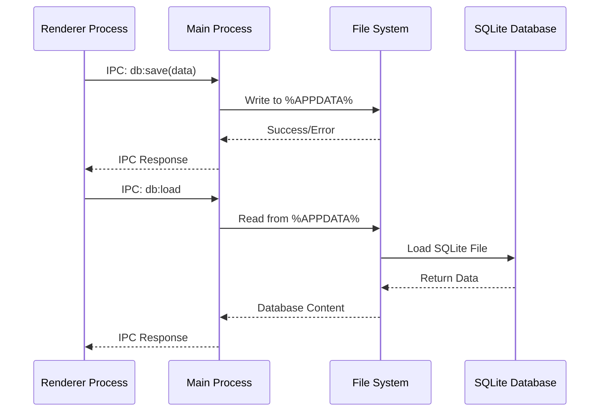
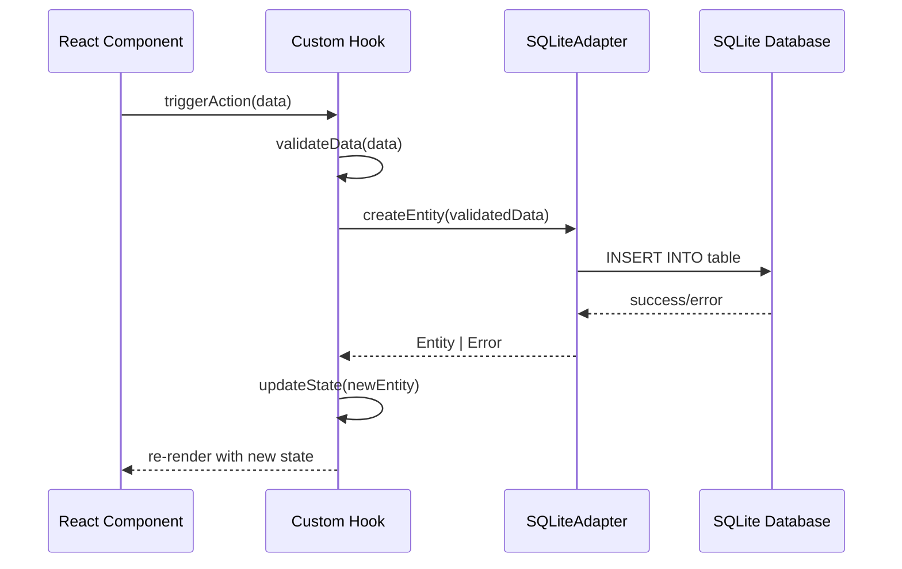
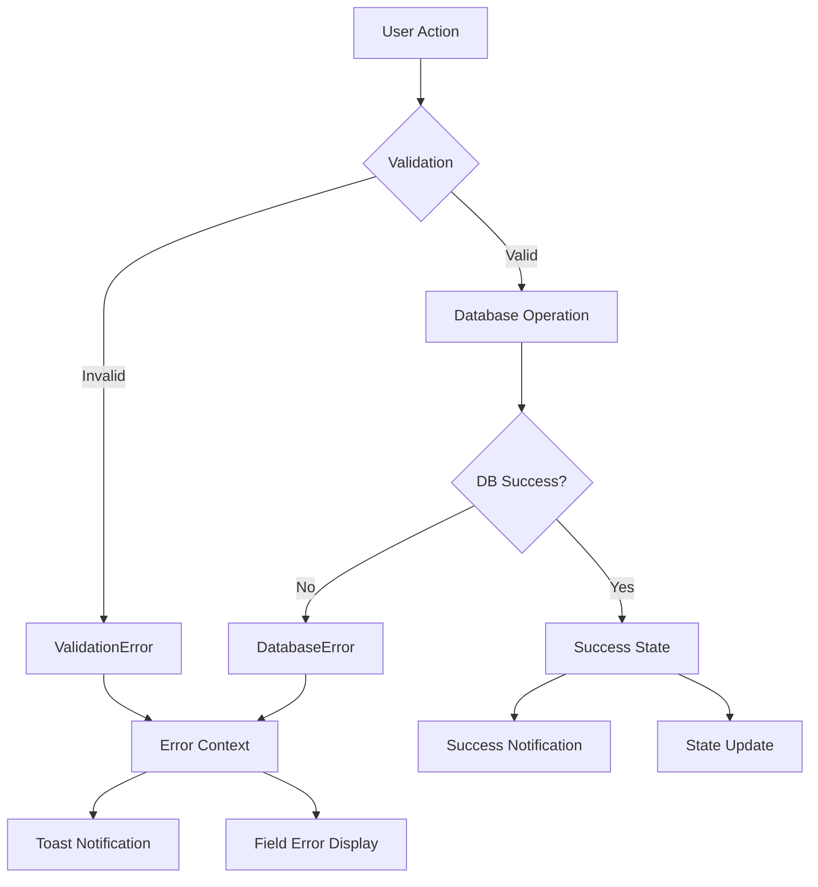

# 🏗️ RawaLite - Architektur-Dokumentation

> **Technische Architektur und Design-Patterns** - Version 1.5.5 (Current: Dezember 2024)

## 📊 **Überblick**

RawaLite ist eine moderne Desktop-Anwendung für Geschäftsverwaltung, basierend auf **Electron** + **React** + **TypeScript** mit **SQLite**-Persistierung. Die Architektur folgt modernen **Clean Architecture**-Prinzipien mit strikter Trennung zwischen UI-Layer, Business Logic und Datenschicht.

## 🎯 **Architektur-Prinzipien**

### **1. Layered Architecture**
```
┌─────────────────────────────────────┐
│           Presentation Layer        │  React Components & Pages
├─────────────────────────────────────┤
│           Business Logic Layer      │  Custom Hooks & Services  
├─────────────────────────────────────┤
│           Persistence Layer         │  Adapters & Database
├─────────────────────────────────────┤
│           Data Storage Layer        │  SQLite Database
└─────────────────────────────────────┘
```

### **2. Dependency Inversion**
- **High-level modules** (UI-Komponenten) importieren keine low-level modules
- **Abstractions** (Interfaces) definieren Verträge
- **Implementations** (Adapters) implementieren Abstractions
- **Dependency Injection** über React Context

### **3. Single Responsibility**
- **Components**: Nur UI-Darstellung und Event-Handling
- **Hooks**: Business-Logik und State-Management
- **Adapters**: Datenbank-Operationen und Persistierung
- **Services**: Cross-Cutting Concerns (PDF, Crypto, etc.)

## 🧱 **Komponenten-Architektur**

### **Frontend Architecture (React)**



### **Backend Architecture (Electron)**



## 📁 **Projekt-Struktur**

### **Root-Level**
```
RawaLite/
├── 📦 package.json               # Dependencies & Scripts
├── ⚙️ vite.config.mts           # Vite Build Configuration
├── 🔧 electron-builder.yml      # Electron Build Configuration
├── 🎯 tsconfig.json             # TypeScript Configuration
├── 📚 docs/                     # Documentation
├── 🖥️ electron/                # Electron Main Process
├── 🧪 tests/                   # Unit Tests
├── 🎭 e2e/                     # End-to-End Tests
├── 🎨 assets/                  # Static Assets
└── 🎨 src/                     # Main Application Code
```

### **Source Code Structure**
```
src/
├── 📋 App.tsx                   # Main Application Component
├── 🚀 main.tsx                  # React Root & Router Setup
├── 🎨 index.css                 # Global Styles & CSS Variables
├── 🔄 PersistenceProvider.tsx   # Database Context Provider
├── 🖥️ PlatformProvider.tsx      # Platform-specific Services
│
├── 📁 adapters/                 # Data Access Layer
│   ├── SQLiteAdapter.ts         # Primary Database Adapter
│   ├── IndexedDBAdapter.ts      # Browser Storage Fallback
│   └── SettingsAdapter.ts       # Configuration Storage
│
├── 🧩 components/               # Reusable UI Components
│   ├── Layout/
│   │   ├── Sidebar.tsx          # Navigation Sidebar
│   │   ├── Header.tsx           # Page Header
│   │   └── Table.tsx            # Generic Data Table
│   └── Forms/
│       ├── CustomerForm.tsx     # Customer Management
│       ├── PackageForm.tsx      # Package Management
│       ├── OfferForm.tsx        # Offer Management
│       ├── InvoiceForm.tsx      # Invoice Management
│       └── TimesheetForm.tsx    # Timesheet Management
│
├── 🎛️ contexts/                 # React Contexts
│   ├── PersistenceContext.tsx   # Database Access
│   ├── LoadingContext.tsx       # Loading States
│   └── NotificationContext.tsx  # Toast Notifications
│
├── 🎣 hooks/                    # Business Logic Hooks
│   ├── useCustomers.ts          # Customer CRUD Operations
│   ├── usePackages.ts           # Package Management
│   ├── useOffers.ts             # Offer Workflow
│   ├── useInvoices.ts           # Invoice Management
│   ├── useTimesheets.ts         # Timesheet Operations
│   ├── useActivities.ts         # Activity Management
│   ├── useSettings.ts           # Settings Management
│   └── useUnifiedSettings.ts    # Centralized Settings
│
├── 📚 lib/                      # Utility Libraries
│   ├── errors.ts                # Error Handling & Validation
│   ├── numbering.ts             # Auto-Numbering System
│   └── settings.ts              # Settings Utilities
│
├── 📄 pages/                    # Route Components
│   ├── DashboardPage.tsx        # Main Dashboard
│   ├── KundenPage.tsx           # Customers Management
│   ├── PaketePage.tsx           # Packages Management
│   ├── AngebotePage.tsx         # Offers List
│   ├── AngebotDetailPage.tsx    # Individual Offer View
│   ├── RechnungenPage.tsx       # Invoices Management
│   ├── TimesheetsPage.tsx       # Timesheets Management
│   ├── EinstellungenPage.tsx    # Settings & Configuration
│   ├── UpdatesPage.tsx          # Updates & Changelog
│   └── NotFoundPage.tsx         # 404 Error Page
│
├── 💾 persistence/              # Data Layer Abstractions
│   ├── adapter.ts               # Core Interfaces & Types
│   ├── customers.ts             # Customer Data Layer
│   ├── localStorageAdapter.ts   # LocalStorage Adapter
│   └── sqlite/
│       └── db.ts                # SQLite Schema & Connection
│
└── 🛠️ services/                # Cross-Cutting Services
    ├── CryptoService.ts         # Encryption & Security
    ├── ExportService.ts         # Data Export (CSV, PDF)
    ├── LoggingService.ts        # Application Logging
    ├── NummernkreisService.ts   # Auto-Numbering Service
    └── PDFService.ts            # PDF Generation
```

## 🔄 **Data Flow Architecture**

### **CRUD Operations Flow**


### **Error Handling Flow**


## 🗃️ **Datenbank-Architektur**

### **SQLite Schema Design**

```sql
-- Konfigurationstabelle (Singleton Pattern)
CREATE TABLE settings (
    id INTEGER PRIMARY KEY CHECK (id = 1),  -- Singleton Constraint
    companyName TEXT,
    -- Weitere Settings...
    nextCustomerNumber INTEGER DEFAULT 1,
    nextOfferNumber INTEGER DEFAULT 1,
    nextInvoiceNumber INTEGER DEFAULT 1,
    nextTimesheetNumber INTEGER DEFAULT 1,
    createdAt TEXT NOT NULL,
    updatedAt TEXT NOT NULL
);

-- Kernentitäten mit Auto-Nummerierung
CREATE TABLE customers (
    id INTEGER PRIMARY KEY AUTOINCREMENT,
    number TEXT NOT NULL UNIQUE,          -- K-0001, K-0002...
    name TEXT NOT NULL,
    -- Weitere Kundenfelder...
    createdAt TEXT NOT NULL,
    updatedAt TEXT NOT NULL
);

-- Hierarchische Strukturen (Pakete)
CREATE TABLE packages (
    id INTEGER PRIMARY KEY AUTOINCREMENT,
    parentPackageId INTEGER REFERENCES packages(id) ON DELETE CASCADE,
    -- Weitere Paketfelder...
);

-- Line Items mit Parent-Child Relationships
CREATE TABLE package_line_items (
    id INTEGER PRIMARY KEY AUTOINCREMENT,
    packageId INTEGER NOT NULL REFERENCES packages(id) ON DELETE CASCADE,
    parentItemId INTEGER REFERENCES package_line_items(id) ON DELETE CASCADE,
    -- Weitere Line Item Felder...
);

-- Status-Tracking für Workflows
CREATE TABLE offers (
    id INTEGER PRIMARY KEY AUTOINCREMENT,
    status TEXT NOT NULL DEFAULT 'draft' CHECK (status IN ('draft', 'sent', 'accepted', 'rejected')),
    -- Status-Zeitstempel
    sentAt TEXT,
    acceptedAt TEXT,
    rejectedAt TEXT,
    createdAt TEXT NOT NULL,
    updatedAt TEXT NOT NULL
);

-- Leistungsnachweise mit Tätigkeiten-System
CREATE TABLE timesheets (
    id INTEGER PRIMARY KEY AUTOINCREMENT,
    timesheetNumber TEXT NOT NULL UNIQUE,
    customerId INTEGER NOT NULL REFERENCES customers(id) ON DELETE CASCADE,
    status TEXT NOT NULL DEFAULT 'draft',
    -- Weitere Timesheet-Felder...
);

CREATE TABLE activities (
    id INTEGER PRIMARY KEY AUTOINCREMENT,
    name TEXT NOT NULL,
    defaultHourlyRate REAL NOT NULL DEFAULT 0,
    isActive INTEGER DEFAULT 1,
    createdAt TEXT NOT NULL,
    updatedAt TEXT NOT NULL
);

CREATE TABLE timesheet_activities (
    id INTEGER PRIMARY KEY AUTOINCREMENT,
    timesheetId INTEGER NOT NULL REFERENCES timesheets(id) ON DELETE CASCADE,
    activityId INTEGER NOT NULL REFERENCES activities(id),
    hours REAL NOT NULL DEFAULT 0,
    hourlyRate REAL NOT NULL DEFAULT 0,
    total REAL NOT NULL DEFAULT 0,
    description TEXT
);
```

### **Datenbank-Patterns**

#### **1. Singleton Pattern (Settings)**
```typescript
interface Settings {
  id: 1; // Always 1 - enforced by CHECK constraint
  companyName?: string;
  // ... other settings
}

// In SQLiteAdapter:
async getSettings(): Promise<Settings> {
  const rows = all<Settings>(`SELECT * FROM settings WHERE id = 1`);
  return rows[0] || this.createDefaultSettings();
}
```

#### **2. Auto-Numbering Pattern**
```typescript
async getNextNumber(type: 'customer' | 'offer' | 'invoice' | 'timesheet'): Promise<string> {
  const settings = await this.getSettings();
  const nextNumber = settings[`next${type.charAt(0).toUpperCase() + type.slice(1)}Number`];
  
  // Generate number (e.g., K-0001, AN-2025-0001)
  const number = this.generateNumber(type, nextNumber);
  
  // Increment counter
  await this.updateSettings({
    [`next${type.charAt(0).toUpperCase() + type.slice(1)}Number`]: nextNumber + 1
  });
  
  return number;
}
```

#### **3. Hierarchical Data Pattern**
```typescript
interface PackageTreeNode extends Package {
  children: PackageTreeNode[];
  lineItems: LineItemTreeNode[];
}

// Recursive loading with proper joins
async buildPackageTree(parentId?: number): Promise<PackageTreeNode[]> {
  const packages = await this.getPackagesByParent(parentId);
  
  return Promise.all(packages.map(async pkg => ({
    ...pkg,
    children: await this.buildPackageTree(pkg.id),
    lineItems: await this.buildLineItemTree(pkg.id)
  })));
}
```

#### **4. Status Workflow Pattern**
```typescript
interface StatusEntity {
  status: 'draft' | 'sent' | 'accepted' | 'rejected';
  sentAt?: string;
  acceptedAt?: string;
  rejectedAt?: string;
}

async updateStatus<T extends StatusEntity>(
  id: number, 
  status: T['status']
): Promise<void> {
  const timestamp = new Date().toISOString();
  const statusTimestamp = `${status}At`;
  
  await this.update(id, {
    status,
    [statusTimestamp]: timestamp
  });
}
```

## 🎨 **UI-Architektur**

### **Component Hierarchy**
```
App
├── PersistenceProvider
│   ├── PlatformProvider
│   │   ├── LoadingProvider
│   │   │   ├── NotificationProvider
│   │   │   │   └── Router
│   │   │   │       ├── Layout
│   │   │   │       │   ├── Sidebar
│   │   │   │       │   ├── Header
│   │   │   │       │   └── MainContent
│   │   │   │       └── Pages
│   │   │   │           ├── DashboardPage
│   │   │   │           ├── KundenPage
│   │   │   │           ├── TimesheetsPage
│   │   │   │           └── ...
```

### **State Management Pattern**

#### **1. Context + Custom Hooks Pattern**
```typescript
// Context für Datenzugang
const PersistenceContext = createContext<{
  adapter: PersistenceAdapter;
}>()

// Custom Hook für Business Logic
export function useCustomers() {
  const { adapter } = usePersistence();
  const [customers, setCustomers] = useState<Customer[]>([]);
  
  async function createCustomer(data: CustomerData) {
    // 1. Validierung
    validateCustomerData(data);
    
    // 2. Geschäftslogik (Auto-Nummerierung)
    const number = await getNextNumber('customer');
    
    // 3. Persistierung
    const customer = await adapter.createCustomer({ ...data, number });
    
    // 4. State Update
    setCustomers(prev => [...prev, customer]);
    
    return customer;
  }
  
  return { customers, createCustomer, /* ... */ };
}
```

#### **2. Optimistic UI Updates**
```typescript
async function updateCustomer(id: number, changes: Partial<Customer>) {
  // Optimistic Update
  setCustomers(prev => prev.map(c => 
    c.id === id ? { ...c, ...changes } : c
  ));
  
  try {
    // Actual Update
    await adapter.updateCustomer(id, changes);
  } catch (error) {
    // Rollback on Error
    loadCustomers(); // Reload from database
    throw error;
  }
}
```

### **CSS Architecture**

#### **1. CSS Custom Properties (Design Tokens)**
```css
:root {
  /* Semantic Color System */
  --bg: #0f172a;                 /* Background */
  --panel: #111827;              /* Panels */
  --foreground: #374151;         /* Text */
  --accent: #1e3a2e;            /* Primary Actions */
  --ok: #22c55e;                /* Success */
  --warn: #f59e0b;              /* Warning */
  --danger: #ef4444;            /* Error */
  
  /* Specialized Gradients */
  --sidebar-bg: linear-gradient(160deg, #1e3a2e 0%, #0f2419 40%, #0a1b0f 100%);
  --main-bg-dark: linear-gradient(135deg, #1e293b 0%, #0f172a 50%, #020617 100%);
}
```

#### **2. Component-Scoped CSS Classes**
```css
/* Utility Classes */
.card {
  background: rgba(255,255,255,0.98);
  backdrop-filter: blur(10px);
  border-radius: 14px;
  box-shadow: 0 10px 30px rgba(0,0,0,.15);
}

.btn {
  /* Base button styles */
  transition: all 0.2s ease;
}

.btn-primary { background: var(--accent); }
.btn-success { background: var(--ok); }
.btn-danger { background: var(--danger); }
```

#### **3. Grid-Based Layout System**
```css
.app {
  display: grid;
  grid-template-columns: 240px 1fr;
  grid-template-rows: 56px 1fr;
  grid-template-areas:
    "sidebar header"
    "sidebar main";
  min-height: 100%;
}

.sidebar { grid-area: sidebar; }
.header { grid-area: header; }
.main { grid-area: main; }
```

## 🔒 **Security Architecture**

### **1. Input Validation**
```typescript
class ValidationError extends Error {
  constructor(message: string, public field?: string) {
    super(message);
  }
}

function validateCustomer(data: Partial<Customer>): void {
  if (!data.name?.trim()) {
    throw new ValidationError("Name ist erforderlich", "name");
  }
  
  if (data.email && !isValidEmail(data.email)) {
    throw new ValidationError("Ungültige E-Mail-Adresse", "email");
  }
}
```

### **2. SQL Injection Prevention**
```typescript
// ✅ Korrekt: Prepared Statements
async createCustomer(data: CustomerData): Promise<Customer> {
  return withTx(() => {
    run(
      `INSERT INTO customers (number, name, email) VALUES (?, ?, ?)`,
      [data.number, data.name, data.email]
    );
  });
}

// ❌ Falsch: String Concatenation
// `INSERT INTO customers (name) VALUES ('${data.name}')`  // NEVER!
```

### **3. File System Access Control**
```typescript
// Electron Main Process
ipcMain.handle('db:save', async (event, data: Uint8Array) => {
  const dbPath = path.join(app.getPath('userData'), 'database.sqlite');
  
  // Validate path is within app directory
  if (!isWithinAppDirectory(dbPath)) {
    throw new Error('Unauthorized path access');
  }
  
  await fs.writeFile(dbPath, data);
});
```

## 🚀 **Performance Architecture**

### **1. Database Optimization**
```sql
-- Indexing Strategy
CREATE INDEX idx_customers_number ON customers(number);
CREATE INDEX idx_offers_status ON offers(status);
CREATE INDEX idx_offers_customer ON offers(customerId);
CREATE INDEX idx_timesheet_activities_timesheet ON timesheet_activities(timesheetId);
```

### **2. React Performance Patterns**

#### **Memoization**
```typescript
const CustomerList = React.memo(({ customers }: { customers: Customer[] }) => {
  return (
    <div>
      {customers.map(customer => (
        <CustomerItem key={customer.id} customer={customer} />
      ))}
    </div>
  );
});
```

#### **Virtual Scrolling für große Listen**
```typescript
const VirtualizedTable = ({ items }: { items: any[] }) => {
  const [visibleRange, setVisibleRange] = useState({ start: 0, end: 50 });
  
  return (
    <div onScroll={handleScroll}>
      {items.slice(visibleRange.start, visibleRange.end).map(renderRow)}
    </div>
  );
};
```

### **3. Bundle Optimization**
```typescript
// Code Splitting
const TimesheetsPage = lazy(() => import('./pages/TimesheetsPage'));
const EinstellungenPage = lazy(() => import('./pages/EinstellungenPage'));

// Tree Shaking
export { useCustomers, useOffers } from './hooks'; // Named exports only
```

## 🧪 **Testing Architecture**

### **1. Unit Testing (Vitest)**
```typescript
// Business Logic Testing
describe('NummernkreisService', () => {
  it('should generate correct customer numbers', () => {
    const service = new NummernkreisService();
    expect(service.generate('customer', 1)).toBe('K-0001');
    expect(service.generate('customer', 42)).toBe('K-0042');
  });
});
```

### **2. Integration Testing**
```typescript
// Database Integration
describe('SQLiteAdapter', () => {
  let adapter: SQLiteAdapter;
  
  beforeEach(() => {
    adapter = new SQLiteAdapter(':memory:'); // In-memory DB for tests
  });
  
  it('should create customer with auto-generated number', async () => {
    const customer = await adapter.createCustomer({
      name: 'Test Customer'
    });
    
    expect(customer.number).toMatch(/K-\d{4}/);
  });
});
```

### **3. E2E Testing (Playwright)**
```typescript
// User Workflow Testing
test('complete offer workflow', async ({ page }) => {
  await page.goto('/');
  
  // Create customer
  await page.click('text=Kunden');
  await page.click('text=Neuer Kunde');
  await page.fill('[name="name"]', 'Test Customer');
  await page.click('text=Erstellen');
  
  // Create offer
  await page.click('text=Angebote');
  await page.click('text=Neues Angebot');
  // ... rest of workflow
  
  await expect(page.locator('text=Angebot erstellt')).toBeVisible();
});
```

## 🔄 **Build & Deployment Architecture**

### **Development Build**
```
pnpm dev
├── Vite Dev Server (Port 5173)
├── Electron Main Process
├── Hot Module Reload
└── TypeScript Compilation
```

### **Production Build**
```
pnpm build && pnpm dist
├── Vite Build (dist/)
├── Electron Build (dist-electron/)
├── NSIS Installer Creation
└── Code Signing (optional)
```

### **Build Output Structure**
```
dist/
├── RawaLite Setup 1.5.5.exe     # Windows Installer (167MB)
├── RawaLite Setup 1.5.5.exe.blockmap
├── win-unpacked/                # Portable Version
│   ├── RawaLite.exe
│   └── resources/
└── builder-debug.yml            # Build Metadata
```

### **Build Metrics (Current v1.5.5)**
- **Bundle Size**: 553kB (Vite Build)
- **Installer Size**: 167MB (Electron + Dependencies)
- **Build Time**: ~30-45 Sekunden
- **Target Platform**: Windows x64 (NSIS Installer)

---

## 🎯 **Fazit**

Die RawaLite-Architektur basiert auf **bewährten Patterns** und **modernen Technologien**, um eine **wartbare**, **testbare** und **skalierbare** Desktop-Anwendung zu schaffen. Die strikte **Layered Architecture** ermöglicht einfache Erweiterungen und Änderungen, während die **TypeScript-first**-Philosophie Typsicherheit und Entwicklerproduktivität gewährleistet.

**Wichtige Architektur-Entscheidungen:**
- ✅ **React + TypeScript**: Moderne UI-Entwicklung mit Typsicherheit
- ✅ **SQLite**: Lokale, relationale Datenbank ohne Server-Overhead
- ✅ **Custom Hooks Pattern**: Saubere Trennung von UI und Business Logic
- ✅ **Layered Architecture**: Klare Abhängigkeitsrichtungen und Testbarkeit
- ✅ **Context + Dependency Injection**: Flexible und testbare Datenzugang

---

*Letzte Aktualisierung: 11. September 2025*  
*Version: 1.0.0*
