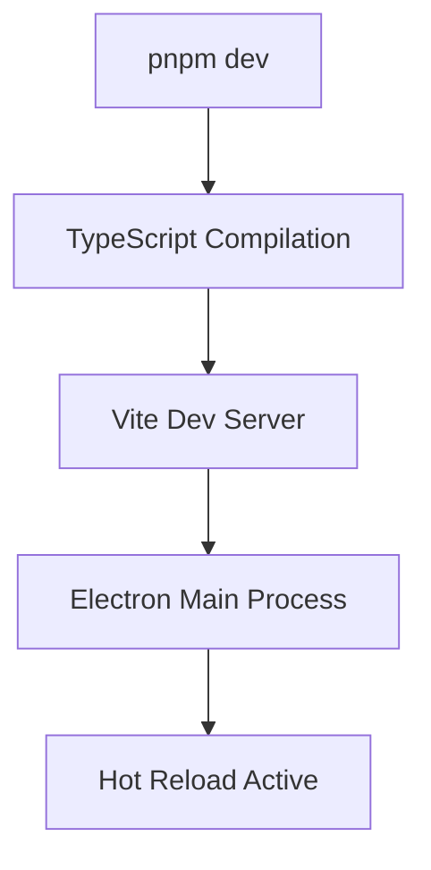
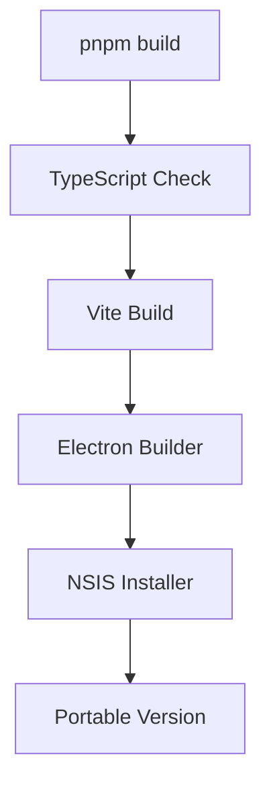

# 🛠️ RawaLite - Developer Guide

> **Entwickler-Dokumentation für Setup, Standards und Workflows** - Version 1.5.6

## 🚀 **Quick Start**

### **System Requirements**
- **Node.js**: 20.18.0 oder höher (`node --version`)
- **pnpm**: 10.15.1 oder höher (`pnpm --version`)
- **Git**: v2.51.0.1 für Versionskontrolle
- **VS Code**: Latest LTS mit TypeScript Extensions
- **PowerShell**: v7.5.2 (Core) - pwsh.exe

### **Production Environment**
- **Electron**: 31.7.7
- **React**: 18.3.1 + TypeScript 5.9.2
- **SQLite**: sql.js 1.13.0 (in-browser)
- **Build Tools**: Vite 5.4.20, esbuild 0.23.1

### **Projekt-Setup**
```powershell
# Repository klonen
git clone https://github.com/MonaFP/RawaLite.git
cd RawaLite

# Dependencies installieren (pnpm bevorzugt)
pnpm install

# Development Server starten
pnpm dev

# Öffnet Electron App mit Hot Reload auf wechselnden Ports (5173, 5174, 5175...)
```

### **Development Umgebung prüfen**
```powershell
# Production Build testen
pnpm build

# Unit Tests (Vitest)
pnpm test

# E2E Tests (Playwright)
pnpm e2e

# TypeScript Validation
pnpm typecheck

# Code Quality
pnpm lint

# Electron Distribution
pnpm dist
```

## 🔬 **Extended Debug Pattern (STANDARD)**

**KRITISCH: Für alle Features IMMER Extended Debug Pattern verwenden!**

### **Template Engine Debugging**
```typescript
// ✅ ALWAYS: Comprehensive debug output
console.log('🚀 === FEATURE DEBUG START ===');

// Step 1: Data Structure Analysis  
console.log('📊 Input Data Analysis:');
console.log('  - Data exists:', !!data);
console.log('  - Data keys:', Object.keys(data));

// Step 2: Process Step Logging
console.log('🔄 Processing Steps:');
template = template.replace(/pattern/g, (match, group) => {
  console.log(`✅ Processed: ${match} → ${result}`);
  return result;
});

// Step 3: Variable Resolution Testing  
console.log('🧪 Critical Variable Test:');
testVars.forEach(varPath => {
  const value = getNestedValue(data, varPath);
  console.log(`  {{${varPath}}} = ${value !== undefined ? `"${value}"` : 'UNDEFINED'}`);
});

console.log('🏁 === FEATURE DEBUG END ===');
```

### **PDF Generation Debug Pattern**
```typescript
// ALWAYS: Log complete template data structure
console.log('📊 Template Data Structure:');
console.log('  - Type:', options.templateType);
console.log('  - Offer exists:', !!templateData.offer);
if (templateData.offer) {
  console.log('  - Offer Number:', templateData.offer.offerNumber);
  console.log('  - Line Items Count:', templateData.offer.lineItems?.length || 0);
}

// ALWAYS: Processing order logging
console.log('🔄 Processing conditionals and loops first...');
console.log('🔄 Processing formatters second...');
console.log('🔄 Processing simple variables last...');
```

**Time Savings: 5-10x faster debugging cycles!**

---

## 🏗️ **Entwicklungsumgebung**

### **VS Code Extensions (Empfohlen)**
```json
{
  "recommendations": [
    "ms-vscode.vscode-typescript-next",
    "bradlc.vscode-tailwindcss",
    "esbenp.prettier-vscode", 
    "ms-vscode.vscode-eslint",
    "ms-playwright.playwright",
    "ms-vscode.vscode-json",
    "GitHub.vscode-github-actions"
  ]
}
```

### **Workspace Settings**
```json
{
  "editor.formatOnSave": true,
  "editor.defaultFormatter": "esbenp.prettier-vscode",
  "typescript.preferences.importModuleSpecifier": "relative",
  "files.exclude": {
    "**/node_modules": true,
    "**/dist": true,
    "**/dist-electron": true
  }
}
```

### **Debugging Setup**

#### **VS Code Launch Configuration**
```json
{
  "version": "0.2.0",
  "configurations": [
    {
      "name": "Debug Electron Main",
      "type": "node",
      "request": "launch",
      "cwd": "${workspaceFolder}",
      "runtimeExecutable": "${workspaceFolder}/node_modules/.bin/electron",
      "windows": {
        "runtimeExecutable": "${workspaceFolder}/node_modules/.bin/electron.cmd"
      },
      "args": [".", "--remote-debugging-port=9222"],
      "outputCapture": "std",
      "console": "integratedTerminal",
      "env": {
        "NODE_ENV": "development"
      }
    },
    {
      "name": "Debug React Renderer",
      "type": "chrome",
      "request": "attach",
      "port": 9222,
      "webRoot": "${workspaceFolder}/src",
      "timeout": 30000
    }
  ],
  "compounds": [
    {
      "name": "Debug Electron + React",
      "configurations": ["Debug Electron Main", "Debug React Renderer"]
    }
  ]
}
```

---

## 📋 **Development Standards**

### **TypeScript Configuration**

#### **Strict Mode aktiviert**
```json
{
  "compilerOptions": {
    "strict": true,
    "noUncheckedIndexedAccess": true,
    "noImplicitReturns": true,
    "noFallthroughCasesInSwitch": true,
    "noUncheckedIndexedAccess": true
  }
}
```

#### **Path Mapping für Imports**
```json
{
  "compilerOptions": {
    "baseUrl": ".",
    "paths": {
      "@/*": ["src/*"],
      "@/components/*": ["src/components/*"],
      "@/hooks/*": ["src/hooks/*"],
      "@/lib/*": ["src/lib/*"],
      "@/types/*": ["src/types/*"]
    }
  }
}
```

### **Naming Conventions**

#### **Files & Directories**
```
📁 components/
   ├── CustomerForm.tsx         # PascalCase für React Components
   ├── useCustomers.ts          # camelCase für Hooks
   └── customers.test.ts        # camelCase für Tests

📁 types/
   ├── domain.ts               # camelCase für Type definitions
   └── api.ts                  # camelCase für API types
```

#### **Code Naming**
```typescript
// Interfaces: PascalCase mit "I" prefix (optional)
interface Customer {
  id: number;
  name: string;
}

// Types: PascalCase
type CustomerData = Omit<Customer, 'id'>;

// Enums: PascalCase
enum CustomerStatus {
  Active = 'active',
  Inactive = 'inactive'
}

// Constants: SCREAMING_SNAKE_CASE
const DEFAULT_PAGE_SIZE = 25;
const API_BASE_URL = 'https://api.example.com';

// Functions: camelCase
function validateCustomer(data: CustomerData): boolean {
  return data.name.trim().length > 0;
}

// React Components: PascalCase
const CustomerForm: React.FC<Props> = ({ customer }) => {
  return <form>...</form>;
};
```

### **Error Handling Patterns**

#### **Custom Error Classes**
```typescript
// lib/errors.ts
export class ValidationError extends Error {
  constructor(
    message: string, 
    public field?: string,
    public code?: string
  ) {
    super(message);
    this.name = 'ValidationError';
  }
}

export class DatabaseError extends Error {
  constructor(message: string, public originalError?: Error) {
    super(message);
    this.name = 'DatabaseError';
    this.cause = originalError;
  }
}
```

#### **Error Handling in Hooks**
```typescript
export function useCustomers() {
  const [error, setError] = useState<Error | null>(null);
  
  async function createCustomer(data: CustomerData) {
    try {
      setError(null);
      validateCustomer(data); // throws ValidationError
      
      const customer = await adapter.createCustomer(data); // throws DatabaseError
      setCustomers(prev => [...prev, customer]);
      
      return customer;
    } catch (err) {
      const error = err as Error;
      setError(error);
      
      // Re-throw to allow component-level handling
      throw error;
    }
  }
  
  return { customers, createCustomer, error };
}
```

### **React Patterns**

#### **Component Structure**
```typescript
interface CustomerFormProps {
  customer?: Customer;
  onSave: (customer: Customer) => void;
  onCancel: () => void;
}

const CustomerForm: React.FC<CustomerFormProps> = ({ 
  customer, 
  onSave, 
  onCancel 
}) => {
  // 1. State declarations
  const [formData, setFormData] = useState<CustomerData>(() => 
    customer ? { name: customer.name, email: customer.email } : { name: '', email: '' }
  );
  
  // 2. Custom hooks
  const { createCustomer, updateCustomer } = useCustomers();
  const { showNotification } = useNotification();
  
  // 3. Effects
  useEffect(() => {
    if (customer) {
      setFormData({ name: customer.name, email: customer.email });
    }
  }, [customer]);
  
  // 4. Event handlers
  const handleSubmit = useCallback(async (e: React.FormEvent) => {
    e.preventDefault();
    try {
      const result = customer 
        ? await updateCustomer(customer.id, formData)
        : await createCustomer(formData);
      
      onSave(result);
      showNotification('Kunde erfolgreich gespeichert', 'success');
    } catch (error) {
      showNotification(error.message, 'error');
    }
  }, [formData, customer, createCustomer, updateCustomer, onSave]);
  
  // 5. Render
  return (
    <form onSubmit={handleSubmit} className="space-y-4">
      {/* Form content */}
    </form>
  );
};

export default CustomerForm;
```

#### **Performance Optimization**
```typescript
// Memoization für teure Berechnungen
const CustomerStats = React.memo(({ customers }: { customers: Customer[] }) => {
  const stats = useMemo(() => {
    return {
      total: customers.length,
      active: customers.filter(c => c.status === 'active').length,
      revenue: customers.reduce((sum, c) => sum + c.totalRevenue, 0)
    };
  }, [customers]);
  
  return <div>...</div>;
});

// useCallback für Event Handlers
const CustomerList: React.FC<Props> = ({ customers }) => {
  const handleCustomerSelect = useCallback((customerId: number) => {
    // Event handling logic
  }, []);
  
  return (
    <div>
      {customers.map(customer => (
        <CustomerItem 
          key={customer.id}
          customer={customer}
          onSelect={handleCustomerSelect}
        />
      ))}
    </div>
  );
};
```

### **CSS/Styling Standards**

#### **CSS Custom Properties Nutzung**
```css
.customer-form {
  background: var(--panel);
  border-radius: var(--border-radius);
  padding: var(--spacing-lg);
  
  /* Avoid magic numbers */
  max-width: var(--max-form-width, 600px);
}

.customer-form__field {
  margin-bottom: var(--spacing-md);
}

.customer-form__field--error {
  border-color: var(--danger);
}
```

#### **Responsive Design Patterns**
```css
.grid-container {
  display: grid;
  gap: var(--spacing-md);
  
  /* Mobile first */
  grid-template-columns: 1fr;
  
  /* Tablet */
  @media (min-width: 768px) {
    grid-template-columns: 1fr 1fr;
  }
  
  /* Desktop */
  @media (min-width: 1024px) {
    grid-template-columns: repeat(3, 1fr);
  }
}
```

---

## 🧪 **Testing Guidelines**

### **Test Structure**
```
tests/
├── unit/                    # Unit Tests
│   ├── hooks/
│   ├── lib/
│   └── services/
├── integration/             # Integration Tests
│   ├── database/
│   └── api/
└── e2e/                    # End-to-End Tests
    ├── customer-workflow.spec.ts
    └── offer-workflow.spec.ts
```

### **Unit Testing mit Vitest**

#### **Hook Testing**
```typescript
// tests/unit/hooks/useCustomers.test.ts
import { renderHook, act } from '@testing-library/react';
import { useCustomers } from '@/hooks/useCustomers';
import { PersistenceProvider } from '@/PersistenceProvider';
import { MockAdapter } from '../__mocks__/MockAdapter';

describe('useCustomers', () => {
  let mockAdapter: MockAdapter;
  
  beforeEach(() => {
    mockAdapter = new MockAdapter();
  });
  
  const wrapper = ({ children }: { children: React.ReactNode }) => (
    <PersistenceProvider adapter={mockAdapter}>
      {children}
    </PersistenceProvider>
  );
  
  it('should create customer with generated number', async () => {
    const { result } = renderHook(() => useCustomers(), { wrapper });
    
    await act(async () => {
      const customer = await result.current.createCustomer({
        name: 'Test Customer',
        email: 'test@example.com'
      });
      
      expect(customer.number).toMatch(/K-\d{4}/);
      expect(result.current.customers).toContainEqual(customer);
    });
  });
  
  it('should handle validation errors', async () => {
    const { result } = renderHook(() => useCustomers(), { wrapper });
    
    await act(async () => {
      await expect(
        result.current.createCustomer({ name: '', email: '' })
      ).rejects.toThrow('Name ist erforderlich');
    });
  });
});
```

#### **Service Testing**
```typescript
// tests/unit/services/NummernkreisService.test.ts
import { NummernkreisService } from '@/services/NummernkreisService';

describe('NummernkreisService', () => {
  let service: NummernkreisService;
  
  beforeEach(() => {
    service = new NummernkreisService();
  });
  
  it('should generate customer numbers with correct format', () => {
    expect(service.generateCustomerNumber(1)).toBe('K-0001');
    expect(service.generateCustomerNumber(42)).toBe('K-0042');
    expect(service.generateCustomerNumber(9999)).toBe('K-9999');
  });
  
  it('should generate offer numbers with year prefix', () => {
    const year = new Date().getFullYear();
    expect(service.generateOfferNumber(1)).toBe(`AN-${year}-0001`);
  });
});
```

### **Integration Testing**

#### **Database Testing**
```typescript
// tests/integration/database/SQLiteAdapter.test.ts
import { SQLiteAdapter } from '@/adapters/SQLiteAdapter';

describe('SQLiteAdapter', () => {
  let adapter: SQLiteAdapter;
  
  beforeEach(async () => {
    // Use in-memory database for testing
    adapter = new SQLiteAdapter(':memory:');
    await adapter.initialize();
  });
  
  afterEach(async () => {
    await adapter.close();
  });
  
  it('should create and retrieve customer', async () => {
    const customerData = {
      name: 'Integration Test Customer',
      email: 'integration@test.com'
    };
    
    const created = await adapter.createCustomer(customerData);
    expect(created.id).toBeDefined();
    expect(created.number).toMatch(/K-\d{4}/);
    
    const retrieved = await adapter.getCustomer(created.id);
    expect(retrieved).toEqual(created);
  });
  
  it('should handle foreign key constraints', async () => {
    await expect(
      adapter.createOffer({
        customerId: 99999, // Non-existent customer
        title: 'Test Offer'
      })
    ).rejects.toThrow();
  });
});
```

### **E2E Testing mit Playwright**

#### **Page Object Pattern**
```typescript
// tests/e2e/pages/CustomerPage.ts
import { Page, Locator } from '@playwright/test';

export class CustomerPage {
  readonly page: Page;
  readonly addButton: Locator;
  readonly nameInput: Locator;
  readonly emailInput: Locator;
  readonly saveButton: Locator;
  readonly customerTable: Locator;
  
  constructor(page: Page) {
    this.page = page;
    this.addButton = page.getByRole('button', { name: 'Neuer Kunde' });
    this.nameInput = page.getByLabel('Name');
    this.emailInput = page.getByLabel('E-Mail');
    this.saveButton = page.getByRole('button', { name: 'Speichern' });
    this.customerTable = page.getByRole('table');
  }
  
  async goto() {
    await this.page.goto('/customers');
  }
  
  async addCustomer(name: string, email: string) {
    await this.addButton.click();
    await this.nameInput.fill(name);
    await this.emailInput.fill(email);
    await this.saveButton.click();
  }
  
  async getCustomerByName(name: string) {
    return this.customerTable.getByText(name).first();
  }
}
```

#### **E2E Test Implementation**
```typescript
// tests/e2e/customer-workflow.spec.ts
import { test, expect } from '@playwright/test';
import { CustomerPage } from './pages/CustomerPage';

test.describe('Customer Management', () => {
  test('should create and display customer', async ({ page }) => {
    const customerPage = new CustomerPage(page);
    await customerPage.goto();
    
    // Create customer
    await customerPage.addCustomer('E2E Test Customer', 'e2e@test.com');
    
    // Verify customer appears in list
    const customerRow = await customerPage.getCustomerByName('E2E Test Customer');
    await expect(customerRow).toBeVisible();
    
    // Verify customer number format
    await expect(page.getByText(/K-\d{4}/).first()).toBeVisible();
  });
  
  test('should show validation errors for empty form', async ({ page }) => {
    const customerPage = new CustomerPage(page);
    await customerPage.goto();
    
    await customerPage.addButton.click();
    await customerPage.saveButton.click();
    
    await expect(page.getByText('Name ist erforderlich')).toBeVisible();
  });
});
```

---

## 📦 **Build & Deployment**

### **Build Scripts Erklärt**
```json
{
  "scripts": {
    "dev": "vite",                              // Development Server
    "build": "tsc && vite build",               // Production Build  
    "build:electron": "tsc && electron-builder", // Electron Build
    "test": "vitest",                           // Unit Tests
    "test:e2e": "playwright test",              // E2E Tests
    "lint": "eslint src --ext ts,tsx",          // Code Linting
    "type-check": "tsc --noEmit"                // TypeScript Check
  }
}
```

### **Build Pipeline**

#### **Development**


#### **Production**


### **Electron Builder Konfiguration**
```yaml
# electron-builder.yml
appId: com.rawalite.app
productName: RawaLite
directories:
  output: dist
  
win:
  target: nsis
  icon: assets/icon.ico
  
nsis:
  oneClick: false
  allowToChangeInstallationDirectory: true
  createDesktopShortcut: true
  createStartMenuShortcut: true
  
files:
  - "dist/**/*"
  - "dist-electron/**/*"
  - "!node_modules"
  - "!src"
  - "!electron"
  - "!tests"
  - "!docs"
```

### **Release Process**

#### **Version Management**
```powershell
# Version bump (patch/minor/major)
pnpm version patch

# Build und Test
pnpm run build
pnpm run test
pnpm run test:e2e

# Electron Build erstellen
pnpm run dist

# Release erstellen
git tag v$(node -p "require('./package.json').version")
git push origin --tags
```

---

## 🐛 **Debugging**

### **Common Issues & Solutions**

#### **1. SQLite Database locked**
```typescript
// Problem: Database locked during development
// Solution: Proper connection management

class SQLiteAdapter {
  private db?: Database;
  
  async close() {
    if (this.db) {
      this.db.close();
      this.db = undefined;
    }
  }
  
  // Always close connections in dev mode
  async withConnection<T>(operation: () => T): Promise<T> {
    try {
      return operation();
    } finally {
      if (process.env.NODE_ENV === 'development') {
        await this.close();
      }
    }
  }
}
```

#### **2. Electron Hot Reload Issues**
```typescript
// Problem: Changes not reflected in Electron
// Solution: Check vite.config.mts

export default defineConfig({
  // Ensure proper build output
  build: {
    outDir: 'dist-electron',
    rollupOptions: {
      external: ['electron']
    }
  },
  
  // Enable HMR for Electron
  server: {
    hmr: {
      port: 5173
    }
  }
});
```

#### **3. TypeScript Path Resolution**
```typescript
// Problem: Import paths not resolving
// Solution: Check tsconfig.json and vite.config.mts alignment

// vite.config.mts
resolve: {
  alias: {
    '@': path.resolve(__dirname, 'src'),
    '@/components': path.resolve(__dirname, 'src/components')
  }
}

// tsconfig.json
"baseUrl": ".",
"paths": {
  "@/*": ["src/*"],
  "@/components/*": ["src/components/*"]
}
```

### **Logging & Monitoring**

#### **Development Logging**
```typescript
// lib/logger.ts
class Logger {
  static debug(message: string, data?: any) {
    if (process.env.NODE_ENV === 'development') {
      console.log(`[DEBUG] ${message}`, data);
    }
  }
  
  static error(message: string, error?: Error) {
    console.error(`[ERROR] ${message}`, error);
    
    // In production: send to monitoring service
    if (process.env.NODE_ENV === 'production') {
      // Send to error tracking service
    }
  }
}

// Usage in components
const { createCustomer } = useCustomers();

const handleCreate = async (data: CustomerData) => {
  Logger.debug('Creating customer', data);
  
  try {
    const customer = await createCustomer(data);
    Logger.debug('Customer created successfully', customer);
  } catch (error) {
    Logger.error('Failed to create customer', error as Error);
    throw error;
  }
};
```

---

## 🔄 **Git Workflow**

### **Branch Strategy**
```
main                    # Production-ready code
├── develop            # Integration branch
├── feature/timesheet  # Feature development
├── fix/database-lock  # Bug fixes
└── hotfix/security   # Critical production fixes
```

### **Commit Conventions**
```
feat: add timesheet module
fix: resolve database connection leaks
docs: update architecture documentation
style: format customer form component
refactor: extract validation utilities
test: add integration tests for offers
chore: update dependencies

# Format: type(scope): description
feat(timesheets): add activity management
fix(database): prevent connection leaks
docs(api): update endpoint documentation
```

### **Pull Request Template**
```markdown
## 🎯 Purpose
Brief description of what this PR accomplishes.

## 🛠️ Changes
- [ ] Feature implementation
- [ ] Bug fix
- [ ] Documentation update
- [ ] Tests added/updated

## 🧪 Testing
- [ ] Unit tests pass
- [ ] Integration tests pass
- [ ] E2E tests pass
- [ ] Manual testing completed

## 📸 Screenshots (if UI changes)
Before/After screenshots for visual changes.

## 🔗 Related Issues
Closes #123
```

---

## 📚 **Resources & References**

### **Documentation Links**
- [React Docs](https://react.dev/)
- [TypeScript Handbook](https://www.typescriptlang.org/docs/)
- [Electron Docs](https://www.electronjs.org/docs)
- [Vite Guide](https://vitejs.dev/guide/)
- [Vitest Documentation](https://vitest.dev/)
- [Playwright Docs](https://playwright.dev/)

### **Project Conventions**
- **Code Style**: Prettier + ESLint
- **Type Safety**: Strict TypeScript
- **Testing**: Vitest + Playwright
- **Build**: Vite + Electron Builder

### **Team Kommunikation**
- **Issues**: GitHub Issues für Bug Reports und Feature Requests
- **Discussions**: GitHub Discussions für allgemeine Fragen
- **Code Review**: Pull Requests mit mindestens einem Reviewer

---

## 🎯 **Fazit**

Dieser Developer Guide bietet eine vollständige Übersicht über die Entwicklungsstandards, Tools und Workflows für RawaLite. Bei Fragen oder Unklarheiten:

1. **README.md** für grundlegende Informationen
2. **ARCHITEKTUR.md** für technische Details
3. **DEV_GUIDE.md** (dieses Dokument) für Entwicklungsrichtlinien

**Wichtige Prinzipien:**
- ✅ **Type Safety First**: Strict TypeScript Konfiguration
- ✅ **Testing**: Umfassende Test-Abdeckung (Unit + Integration + E2E)
- ✅ **Code Quality**: ESLint + Prettier für konsistenten Code
- ✅ **Performance**: React Patterns und Optimierungen
- ✅ **Maintainability**: Klare Struktur und Dokumentation

---

*Letzte Aktualisierung: 11. September 2025*  
*Version: 1.0.0*
