# Database Persistence Migration

## 🎯 Overview

This document describes the database persistence migration system implemented in RawaLite to ensure data continuity across application updates. The system automatically detects and migrates legacy database files to a standardized location.

## 🔍 Problem Statement

Prior to this migration system, RawaLite databases could be stored in inconsistent locations depending on the version:

- **Legacy Location**: `%AppData%/Roaming/rawalite/Shared Dictionary/db`
- **Current Location**: `%AppData%/Roaming/rawalite/data/rawalite.db`

When users updated the application, the new version would look for the database in the current location but find nothing, resulting in apparent data loss while the actual data remained in the legacy location.

## 🛠️ Solution Architecture

### Path Management (`src/lib/paths.ts`)

The solution centralizes all database path logic in a single module:

```typescript
export function getDbPath(): string {
  // Standardized path for all future versions
  return path.join(app.getPath('userData'), 'data', 'rawalite.db');
}

export function getLegacyDbPath(): string {
  // Legacy path where data might exist
  return path.join(app.getPath('userData'), 'Shared Dictionary', 'db');
}
```

### Migration Logic (`electron/main.ts`)

The migration happens automatically during database load:

1. **Check Current**: If `rawalite.db` exists, use it (already migrated)
2. **Check Legacy**: If legacy `db` exists and current doesn't, migrate
3. **Create Backup**: Before migration, create timestamped backup
4. **Copy Data**: Copy legacy database to new standardized location
5. **Verify Integrity**: Ensure file sizes match after migration

### Migration Flow

```mermaid
flowchart TD
    A[App Starts] --> B[db:load IPC called]
    B --> C{Current DB exists?}
    C -->|Yes| D[Use Current DB]
    C -->|No| E{Legacy DB exists?}
    E -->|No| F[Fresh Install - Create New DB]
    E -->|Yes| G[Create Backup]
    G --> H[Copy Legacy → Current]
    H --> I[Verify Migration]
    I --> J[Use Migrated DB]
    
    D --> K[App Ready]
    F --> K
    J --> K
```



## 🚨 Safety Features

### 1. **Backup System**

Before any migration, the system creates a timestamped backup:

- **Location**: `%AppData%/Roaming/rawalite/backup/migration-{timestamp}/`
- **Content**: Exact copy of legacy database
- **Purpose**: Recovery option if migration fails

### 2. **Idempotent Operations**

Migration can be run multiple times safely:

- If current DB exists, no migration occurs
- Legacy DB is preserved after successful migration
- No data is ever deleted, only copied

### 3. **Security Validation**

All database paths are validated:

```typescript
export function isWithinUserDataDir(targetPath: string): boolean {
  const userDataPath = app.getPath('userData');
  return path.resolve(targetPath).startsWith(path.resolve(userDataPath));
}
```

### 4. **Integrity Checks**

After migration, file sizes are compared to ensure data integrity:

```typescript
if (legacyStats.size !== newStats.size) {
  throw new Error(`Migration size mismatch: ${legacyStats.size} !== ${newStats.size}`);
}
```

## 📋 Migration Scenarios

### Scenario 1: Fresh Installation
- **State**: No databases exist
- **Action**: Create new database at current location
- **Result**: Normal app startup with empty database

### Scenario 2: Legacy User Update
- **State**: Legacy database exists, no current database
- **Action**: Migrate legacy → current, create backup
- **Result**: All existing data preserved in new location

### Scenario 3: Already Migrated User
- **State**: Current database exists (legacy may also exist)
- **Action**: Use current database, no migration needed
- **Result**: Normal app startup with existing data

### Scenario 4: Migration Failure
- **State**: Migration encounters an error
- **Action**: Keep legacy database intact, log error
- **Result**: Data remains safe, manual intervention may be needed

## 🔍 Monitoring & Logging

The migration system provides comprehensive logging:

```typescript
log.info("=== DATABASE PATH DEBUG ===");
log.info("Current DB Path:", getDbPath());
log.info("Legacy DB Path:", getLegacyDbPath());
log.info("Current DB exists:", fs.existsSync(getDbPath()));
log.info("Legacy DB exists:", fs.existsSync(getLegacyDbPath()));
```

Migration events are logged with:
- Source and destination paths
- File sizes (before/after)
- Backup locations
- Success/failure status

## 🧪 Testing Strategy

### Unit Tests (`tests/unit/paths.test.ts`)

- Path generation correctness
- Security validation functions
- Directory management utilities
- Mock scenarios for all cases

### E2E Tests (`e2e/database-migration.spec.ts`)

- Real migration scenarios with Playwright
- Data preservation verification
- Performance testing for large databases
- Fresh installation testing

### Manual Testing Checklist

1. **Create legacy database** with sample data
2. **Update application** to new version with migration
3. **Verify data appears** in migrated app
4. **Check backup creation** in backup directory
5. **Restart app** multiple times (idempotent test)

## 🔧 Troubleshooting

### Migration Not Occurring

1. Check if current database already exists
2. Verify legacy database path and permissions
3. Review logs for migration attempt messages

### Data Missing After Update

1. Check both current and legacy database locations
2. Look for backup files in backup directory
3. Review main process logs for migration errors

### Performance Issues

1. Migration time depends on database size
2. Large databases (>100MB) may take several seconds
3. Monitor disk space during migration (needs 2x database size)

## 🎯 Future Considerations

### Version Compatibility

The migration system is designed to handle:
- Current legacy format → standardized format
- Future format changes via additional migration steps
- Multiple legacy formats if needed

### Performance Optimization

For very large databases, consider:
- Streaming copy instead of full memory load
- Progress reporting for long migrations
- Background migration with user notification

### Data Validation

Future enhancements could include:
- SQLite header validation before migration
- Schema compatibility checking
- Corrupt database recovery procedures

---

## 🚀 Deployment Notes

This migration system is:
- **Automatic**: No user intervention required
- **Safe**: Original data is never deleted
- **Fast**: Typical migration takes <5 seconds
- **Reliable**: Includes rollback capabilities via backups

The implementation ensures that users upgrading from any previous version will retain their data without manual intervention.